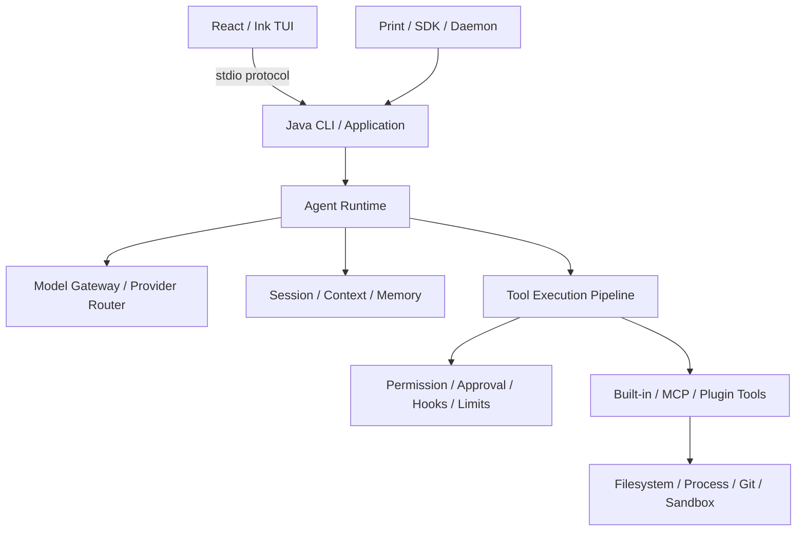

# codej

面向开发者的开源 Coding Agent CLI，以 Java 构建核心运行时。

`codej` 在终端中理解代码仓库、规划任务、搜索和修改文件、执行命令并验证结果。它不只是模型 API 的命令行包装：Agent Loop、Tool Pipeline、Permission、Session、Context 与扩展机制都由项目自己的 Java Runtime 管理。

[官网](https://codej.sixmai.top) · [安装](#安装) · [技术架构](#技术架构) · [使用文档](./docs/product-requirements.md) · [Apache-2.0](./LICENSE)

## 安装

当前提供 Windows x64 与 Linux x64 自包含发行包，已内置 Java 和 Node.js Runtime。macOS 发行包尚未提供。

Windows PowerShell：

```powershell
irm https://codej.sixmai.top/install.ps1 | iex
```

Linux：

```bash
curl -fsSL https://codej.sixmai.top/install.sh | sh
```

安装完成后，在任意代码仓库中启动：

```bash
codej
```

也可以直接执行一次非交互任务：

```bash
codej --print "分析这个项目的架构，并指出最值得优先修复的问题"
```

检查安装与运行环境：

```bash
codej --doctor
```

## 首次配置模型

第一次启动且尚未配置模型时，CodeJ 会自动打开最小配置界面，只需要填写三项：

```text
API Base URL  https://api.openai.com/v1
模型名称      你的模型 ID
API Key       你的 API Key
```

API Key 在输入或粘贴后只显示有界脱敏预览，例如 `sk-••••a9K2`。原始内容不会进入命令参数、Agent 协议、Session 或日志。配置完成后直接进入 CodeJ；以后使用 `/connect` 修改。

默认交互路径支持 OpenAI-compatible 自定义 API Key。需要管理多个 Provider 或 Profile 时，可以使用 CLI：

```bash
codej auth login --provider anthropic --profile personal --set-default
codej auth login --provider openrouter --profile personal --from-env OPENROUTER_API_KEY --set-default
codej providers list
codej models list --provider anthropic
```

## 核心能力

- **Coding Agent Loop**：流式响应、多轮 Tool Call、任务转向、取消、预算与明确终止状态。
- **代码操作**：仓库搜索、文件读取、精确 Patch、新文件写入、Git Diff 和受控命令执行。
- **Plan 工作流**：先规划、人工确认、持续执行，并用测试或检查证据决定任务是否完成。
- **Task List**：Session 内独立维护待处理、进行中和已完成任务，支持依赖、恢复、子 Agent 授权和 `/tasks` 交互面板；Plan planning 使用普通 `task_create/task_update/task_list/task_get` 在审批前建立真实执行任务，宿主为新 Task 注入不可伪造的当前 `planId` 绑定。review、每回合提醒和 final correction 只观察该 Plan cohort：同 Session 的普通 Run 或旧 Plan Task 会保留，但既不能满足也不能阻断当前 Plan。批准执行复用原 Task ID，不解析 Markdown、不按标题匹配，也不创建翻译或汇总的第二身份；模型逐项 claim、active、complete，revision 与 claim 由 Java 管理。成功 mutation 会把 Java 权威快照实时推送到唯一 Ink Task 面板；进行中行以黄色动画 spinner 显示 subject 和一次 `active_form`，完成行使用绿色勾选、弱化和删除线，模型进度行不再重复 Task 活动。最终交付只有在确定性 Evidence 满足且当前 Plan cohort 全部 COMPLETED 时才接受；Task 状态仍不能替代 Plan 审批或产物证据。
- **权限与审批**：`Plan`、`Ask for approval`、`Approve for me` 三种运行选择，以及 Allow Once、Session Grant、Deny 和 Hard Denial。
- **会话与上下文**：Resume、Fork、Checkpoint、Diff/Undo、上下文压缩、文件记忆与项目 Instructions。
- **扩展能力**：Hooks、MCP、Skills、Plugins、Subagent、Worktree 与后台任务统一接入运行时。
- **工程化发行**：自包含运行时、checksum、SBOM、安装升级、回滚和构建身份校验。

所有内置 Tool、MCP Tool 和 Plugin Tool 都经过同一条确定性执行链：

```text
参数校验 → Permission → Approval → Hook → Execute → Truncate → Redact → Tool Result
```

模型只能提出操作意图，不能绕过应用代码直接访问文件系统、Shell 或网络。

## 技术栈

| 层次 | 技术 | 职责 |
| --- | --- | --- |
| 核心运行时 | **Java 21** | Agent Loop、领域协议、权限、会话、上下文与工具管线 |
| 模型适配 | **Spring AI 2.0.0 + Reactor** | 流式响应、Tool Call 与 Provider Adapter，不接管 Agent Loop |
| CLI | **Picocli 4.7.7** | Headless、Print、Provider/Auth 与运维命令 |
| 终端界面 | **React 19.2.8 + Ink 7.1.1 + TypeScript 7** | TUI、Markdown、审批面板与交互输入 |
| 扩展协议 | **MCP Java SDK 2.0.0、JSON-RPC、stdio、HTTP/SSE** | MCP、Plugin、Hook 与 Java/TUI 通信 |
| 状态与观测 | **Jackson 3.1.0、JSONL、OpenTelemetry 1.54.1** | Session、Checkpoint、稳定协议与隐私安全遥测 |
| 测试 | **JUnit 5.14.3、AssertJ 3.27.7、Vitest 4.1.10** | Fake Model/Tool、协议、安全与 TUI 回归 |
| 构建发行 | **Maven 3.9.16、Node.js 22、GitHub Actions、jlink** | 多模块构建、自包含运行时、checksum 与 SBOM |

## 技术架构



模块依赖保持单向：

```text
cc-java-domain
        ↑
cc-java-core
    ↑           ↑
model-adapter   tool-adapters
        \       /
        cc-java-cli
             ↑
        cc-java-tui
```

`domain` 和 `core` 不依赖 Spring AI、Picocli、React、文件系统或持久化框架。Spring AI 只负责模型协议转换，TUI 只消费事件；工具是否执行、运行何时停止、取消如何传播以及状态如何恢复，均由 Java Runtime 决定。

## 从源码构建

需要 JDK 21、Node.js 22 和 PowerShell 7。

Windows 安装开发命令：

```powershell
pwsh -NoProfile -File .\scripts\InstallCodejDevCommand.ps1 -AddToUserPath
```

完整验证：

```powershell
.\mvnw.cmd clean verify
npm --prefix cc-java-tui ci
npm --prefix cc-java-tui run check
java scripts/ProgressDashboard.java --check
```

Linux 使用 `./mvnw clean verify`。普通测试使用 Fake Model 和 Fake Tool，不依赖网络或真实 API Key。

## 仓库结构

```text
cc-java-domain              # 框架无关协议与值对象
cc-java-core                # Agent Runtime、Pipeline、Session、Context
cc-java-model-spring-ai     # 模型 Provider Adapter
cc-java-tools-local         # 文件、搜索、Patch 与命令工具
cc-java-tools-web           # 受控 Web Search
cc-java-mcp                 # MCP Transport 与 Tool Adapter
cc-java-protocol            # 稳定协议
cc-java-sdk                 # Java SDK
cc-java-observability-otel  # OpenTelemetry Adapter
cc-java-cli                 # Java Composition Root / Headless CLI
cc-java-tui                 # React / Ink 终端界面
```

架构与能力细节：

- [产品需求](./docs/product-requirements.md)
- [技术设计](./docs/technical-design.md)
- [功能对照矩阵](./docs/feature-parity-matrix.md)
- [关键架构决策](./docs/adr/)
- [验证与发布证据](./docs/evidence/)

## 安全边界

模型输出、仓库文件、Tool 参数与外部内容都按不可信输入处理。路径 realpath、Traversal、Symlink/Junction、敏感文件、命令超时与进程树清理由确定性代码处理。

Permission、Approval 和 Checkpoint 不等同于操作系统级 Sandbox。只有通过运行时探测的 WSL2 + bubblewrap 或 Docker 后端才提供对应的进程、文件与网络隔离能力。

## License

[Apache License 2.0](./LICENSE)

CodeJ 是独立开源项目，不隶属于或代表 Anthropic、OpenAI、OpenCode、Spring 或其他 Coding Agent 产品。
