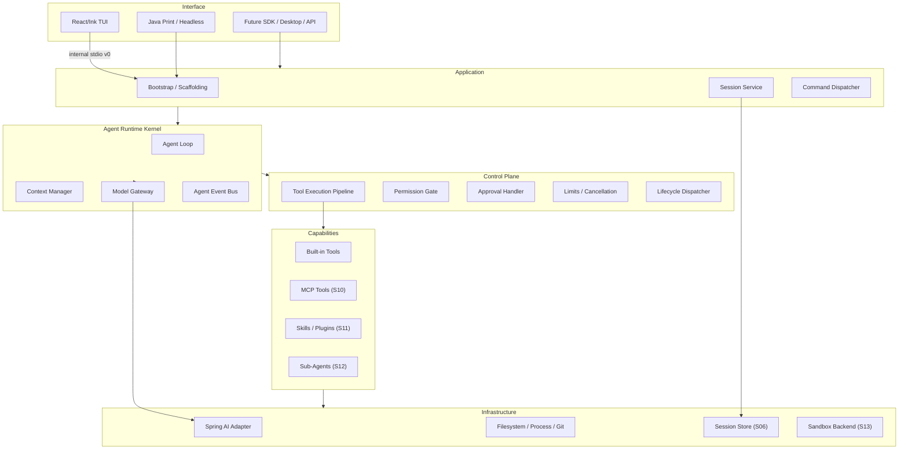
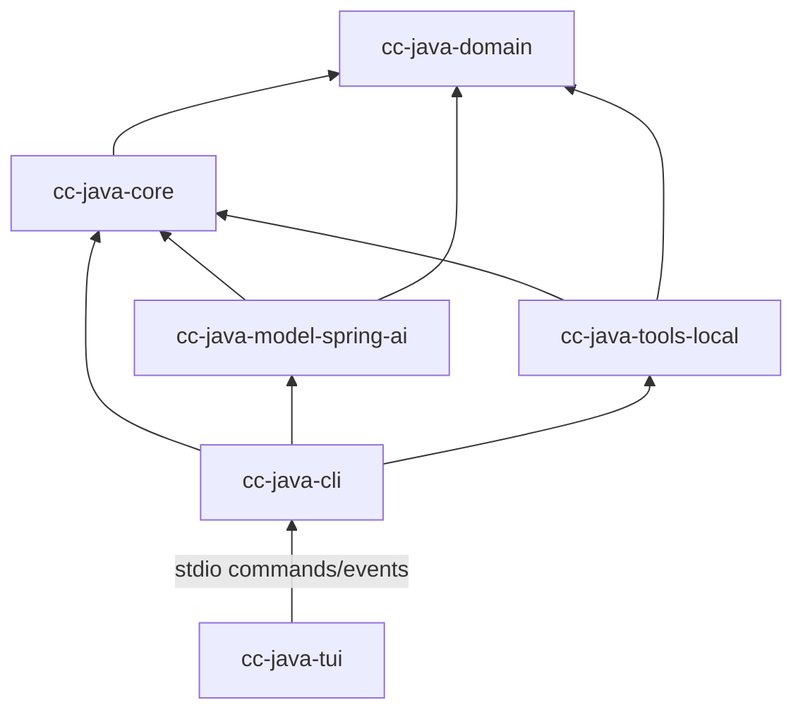
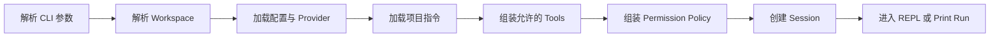
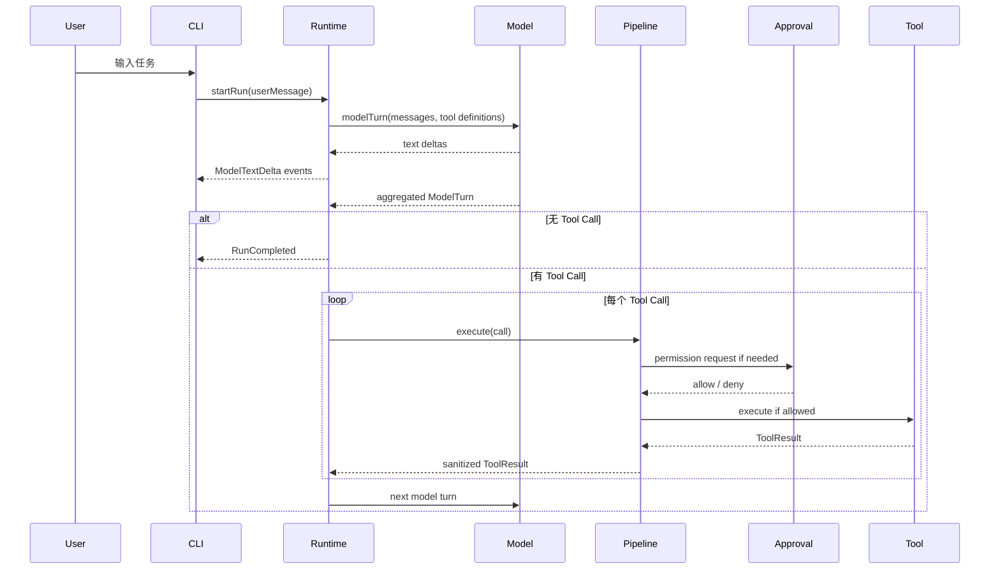
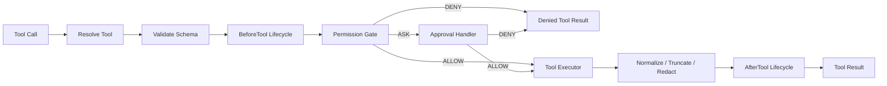

# codej 技术设计文档

> 文档状态：Proposed v0.10
>
> 最后更新：2026-08-17
>
> 对应需求：[产品需求文档](./product-requirements.md)
>
> 当前学习阶段：S15 IN_PROGRESS / Stage Exit OPEN；S01-S08 已 Accepted；ADR-048 corrective implementation Commit
> `8fabd94b66881a4a8236cccabd4ae61dd39845d4` 已完成 ADR-048 G0-G6；ADR-049 的
> `CLI-13`/`CTX-19` 补充切片已在实现 Commit `5910a8f` 上完成 Commit-scoped G0-G6；S09 已完成
> Settings/Trust、Command/loopback HTTP、Compact、Context Projection 与生产装配并 Accepted；S10 MCP
> Tool 主链已完成两个 Transport、多 Server、统一 Permission、Trust 与恢复并通过真实 E2E，Accepted；
> S11 Skills + Plugins 已在实现 Commit `71278431dd1e5c7c4e279b44f43e084755502a5d` 上完成 Commit-scoped G0-G6；`SKILL-01..07`、`CTX-14`、`PLUGIN-01..03` 为 L2，`PLUGIN-04` 为 L1，Stage Exit Accepted。S12 已在实现 Commit `cfbe0282b37a93e38256c3d2d6f22ed2207975a5` 上完成 Commit-scoped G0-G6；冻结的 L2/L1 目标与 Stage Exit Accepted。S13 已在实现 Commit `8a75d5f5e977ce4c5fcd19fafb3e5776a5ec2bf3` 上完成 Commit-scoped G0-G6 与 Stage Exit Accepted：ExecutionBackend/五维 policy、WSL2+bwrap Linux A、Docker B、Windows process/env B（file/network U）、攻击验证、Command Hook/MCP stdio managed seam 与 root/child execution composition 均已固定。S14 已在实现 Commit `dff814c1bb5a659979e007061e6d10a0a9ff6e82` 上完成 Commit-scoped G0-G6，Stage Exit Accepted with documented deviations。S15 的 `PERM-05` 已完成 Headless、stdio 与 React/Ink 三选 picker 的受限生产接线和离线 Fake/E2E，达到 L1；真实 Provider Eval 未完成。`CFG-07/HOOK-10` 保持 L1，`SEC-11` 保持 L0，外部条件不足项不计 L3。
>
> 当前实现状态：ADR-042/043/044 已固定并验证 Context Projection、条件式 Reduction、文件记忆和零等待
> 预取的独立契约；C1-C4 Runtime Projection、typed overflow、Provider Adapter、显式启动容量的 Headless
> composition、ready-only Memory Core/Domain Runtime seam、D2 Headless 文件系统生产装配、Context View 与
> deterministic Fake Demo/Eval 已完成 Commit-scoped G0-G6 对账。ADR-045 冻结 S08 机制研究边界，ADR-046 已冻结 G1 独立产品契约；
> ADR-047 已冻结 S08 的 Domain/Core/Application/Adapter 边界、独立 user-root guard、严格 Settings parser/last-known-good、命令 Intent/Event 与历史 G3/G4 切片。ADR-048 因 CLI-08/09 验收不足重开 S08，并实现 `ComposerState`、无损 Paste、显式提交预算和独立 `ModelDiagnostic` 平面；完整 Reactor、TUI 111/111、launcher 59/59、真实 TTY G5 与独立 review 已通过，并以 implementation Commit `8fabd94b66881a4a8236cccabd4ae61dd39845d4` 完成 G6 对账。
> ADR-049 进一步加入提交前 Workspace-safe 文件快照、JSONL Resume/Fork、确定性 Base64 文件信封、原始协议路径候选与 TUI mention 格式化；实现 Commit `5910a8f` 上完整 Reactor 52/173/45/158/261（Spring 2 skipped）、TUI 128/128 与 launcher 59/59 已通过，`CLI-13`/`CTX-19` 达到 L2。
>
> 阶段与能力权威：[功能对照矩阵](./feature-parity-matrix.md)
>
> Plan gate 当前仍为 S15 L1。ADR-076 提供 durable Markdown artifact；ADR-077 以同一 Session 的正常多轮 loop、capability/effect 双 Gate、CAS 控制 Tool、callId 结构化问题和 durable review 取代用户严格 JSON/静态五 Tool 路径。旧 `PlanDocument`/parser/命令只保留内部兼容。Batch 3 durable approval-to-execution 与 Batch 5 Evidence Gate/安装版构建身份闭环均已实现；真实 Provider Plan 质量与 S15 L4 A/B Eval 仍未完成，不提前提升等级。
>
> PERM-05 Eval 采用默认离线 registered-seed harness：只聚合 typed decision、failure kind、latency、usage-derived cost、gateway/fast-path/circuit counters，不保存 Prompt、模型输出、原始 Tool args、文件正文或 Secret。真实 Provider suite 必须显式 opt-in；环境变量或凭证缺失时结构化报告为 `SKIPPED`，普通 CI 不受影响，且只断言安全阈值而不依赖固定自然语言。

## 1. 设计目标

`cc-java` 的技术目标是独立实现一个 Java 原生、可嵌入、可测试的 Coding Agent Runtime，
并首先通过终端 CLI 交付。

项目采用“公开行为基线 + 授权机制研究 + 独立研究问题 → Java Runtime 与独立 Surface
重实现 → 行为对照 → 差距复盘
→ 独立创新”的学习路径。技术实现不是围绕一次性 MVP 自由生长，而是按 S00～S15
逐步理解和重建成熟 Coding Agent Harness 的可解释能力。

核心架构必须能够支撑：

- 交互式和非交互式运行；
- 模型流式输出与 Tool Calling；
- 文件读取、搜索、修改和命令执行；
- 权限、审批、取消、限制和生命周期事件；
- 会话、上下文、Hooks、Skills、MCP 和 Sub-Agent 的渐进演进。

FixBug 不出现在 Runtime 架构中。它未来只能作为一组 Prompt、Skill、Tool 或上层 Application 使用通用 Runtime。

S01～S04 会逐步形成第一个可运行的 Mini Coding Agent CLI。它只是验证 Runtime、Model、Tool 和终端边界的阶段检查点，不是功能终点，也不表示已达到参考产品对等。后续仍须按矩阵完成 Permission、Session、Context、Hooks、MCP、Skills、Sub-Agent、Sandbox 和 Production Harness。

## 2. 参考方法与独立重实现边界

设计输入来自：

1. 本项目自己的产品需求和验收任务；
2. Spring AI 官方公开 API；
3. Claude Code 等成熟 CLI 的公开文档和可观察行为；
4. Harness Engineering 的通用架构分析，但只作为 `Inferred` 研究问题；
5. `AUTH-SRC-2026-07-29-A` 的仓库外受控机制研究。

设计不使用以下输入：

- 泄露、未授权或超出授权范围源码的具体实现；
- 参考源码中的函数体、私有类型名、注释、Prompt、错误文案、文件布局和实现常量；
- 商业产品内部 Session、Hook 或配置格式；
- 无法确认许可证的代码片段。

本项目借鉴的是“显式 Agent Loop、统一 Tool Pipeline、纵深权限、上下文压力、可恢复会话
和扩展层”等职责、不变量和失败恢复，而不是进行 Java 翻译。公开资料结论必须标记为
`Documented / Observed / Inferred / Unknown`；只有本项目测试、Demo 或 Eval 通过后，
才能声明 `Verified in cc-java`。

详细映射见 [参考架构研究](./reference-architecture.md)、
[公开行为基线](./reference-baselines/R2026.03-public-behavior.md)、
[授权参考源码登记](./reference-baselines/R2026.03-authorized-source.md)、
[ADR-022](./adr/ADR-022-reactivate-authorized-reference-study.md)和
[ADR-023](./adr/ADR-023-s02-java-headless-ink-tui.md)、
[ADR-024](./adr/ADR-024-s02-openai-compatible-first-provider.md)和
[ADR-032](./adr/ADR-032-s03-read-tools-security-contract.md)。

### 2.1 阶段权威与完成证据

[功能对照矩阵](./feature-parity-matrix.md) 是以下内容的唯一权威：

- S00～S15 的主题、顺序和完成定义；
- 每项 Capability ID 所属 Stage；
- L0～L4 完成度及行为对照状态；
- 当前差距和下一项学习能力。

本文负责解释 Java Runtime 与各 Surface 如何分层、如何保持依赖方向以及如何实现安全边界。若本文中的阶段归属与矩阵冲突，应先以矩阵为准，再在同一变更中修正本文。

每个 Stage 结束前必须通过：

1. G0：来源、权利边界、版本/Revision、必要指纹和结论置信度；
2. G1：Stage、Feature ID、当前等级、退出目标和可证伪行为；
3. G2：机制研究、未知项、ADR、Runtime/Surface 边界和安全不变量；
4. G3：最小独立实现、Java 中文公共契约和 UI 可测试契约；
5. G4：确定性测试、故障注入、行为对照和量化指标；
6. G5：具有实际结果和负例的可复现 Demo；
7. G6：矩阵、README、PRD、技术设计、证据和差距报告对账。

字段和未通过条件见 [Stage 证据包模板](./templates/stage-evidence-package.md)。

只完成代码、只跑通 Demo 或只更新矩阵，都不构成 Stage 完成。

## 3. 架构原则

### 3.1 Runtime 是产品核心

CLI、未来桌面端和 SDK 都只是 Runtime 的 Client。Agent Loop、工具执行、权限和 Session 不能写进终端代码。

### 3.2 模型只产生意图

模型可以请求工具，但不能直接访问文件、进程、网络或权限配置。应用代码负责决定：

- 请求是否合法；
- 当前模式是否允许；
- 是否需要人工审批；
- 应如何执行；
- 结果如何裁剪和回传。

### 3.3 所有工具经过同一 Pipeline

内置 Tool、未来 MCP Tool、Plugin Tool 和 Sub-Agent Tool 必须进入同一个 Tool Execution Pipeline。任何绕过 Pipeline 的执行入口都会破坏权限、Hooks、事件和审计。

### 3.4 流式观察，顺序控制

S01 建立顺序 Agent Loop；S02 接入流式模型与终端事件。模型文本、工具输出和状态通过事件增量发给终端，但首轮重实现不把 Reactor 类型泄漏到核心。安全读工具的有界并行延后到 S12，写工具始终默认顺序执行。

### 3.5 状态显式，终止有限

当前消息、回合数、工具次数、Token、运行时间、权限模式和取消状态都在显式 Run State 中。每条循环路径都有 Stop Reason。

### 3.6 先建立可运行检查点，再持续补齐 Harness

S01～S04 依次完成 Loop、真实模型与 CLI、只读工具、写入与命令，形成真实的“读 → 改 → 跑 → 验证”检查点；S05 再系统完成 Permission Pipeline。此检查点用于验证架构和学习成果，不改变 S06～S15 的既定路线，也不提前实现 Hooks、MCP、Sub-Agent、Sandbox 或插件系统。

## 4. 技术基线

| 项目 | 建议 | 状态 |
| --- | --- | --- |
| Java | 21 | Accepted（S01） |
| Maven | Wrapper 3.3.4 → Maven 3.9.16 | Accepted；Windows 启动缺陷已修复并通过 Commit-scoped G4 |
| GroupId / 根包 | `io.github.liumaishenjian` / `io.github.liumaishenjian.ccjava` | Accepted（S01） |
| Test | JUnit 5.14.3 + AssertJ 3.27.7 | Accepted（S01） |
| Spring Boot | BOM 4.1.0（仅依赖管理，尚不使用 Boot Runtime） | Accepted（S02 Provider Spike） |
| Spring AI | 2.0.0 + `spring-ai-openai`，直接使用 `ChatModel` | Accepted（S02 Provider Spike） |
| CLI Parser | Picocli 4.7.7，只用于 Java Headless 参数 | Accepted（S02 Java Print Spike） |
| Node.js | 22（本机 Spike 基线） | Accepted for S02 Spike |
| Interactive Terminal | React 19.2.8 + Ink 7.1.1 | Accepted for S02 experimental TUI |
| Internal Transport | UTF-8 NDJSON stdio v0 | Accepted for S02 internal transport；S14 前不稳定 |
| 首个 Provider | Spring AI OpenAI Chat + OpenAI 兼容端点 | Accepted（S02 text/tool/usage/finish Spike） |

S01 Commit 不引入 Spring Boot、Spring AI、Picocli、React 或 Ink。S02 已通过真实
Provider、Java Fake/真实 stdio、React/Ink 与 Java Print Spike 固定上述已接受版本。

参考：

- [Spring AI Getting Started](https://docs.spring.io/spring-ai/reference/getting-started.html)
- [Spring AI Tool Calling](https://docs.spring.io/spring-ai/reference/api/tools.html)
- [Spring Boot System Requirements](https://docs.spring.io/spring-boot/system-requirements.html)
- [Ink](https://github.com/vadimdemedes/ink)
- [Gemini CLI 架构](https://github.com/google-gemini/gemini-cli/blob/main/GEMINI.md)
- [OpenCode CLI/TUI](https://github.com/anomalyco/opencode/tree/dev/packages/opencode/src/cli)
- [Codex Rust 架构](https://github.com/openai/codex/blob/main/codex-rs/README.md)

## 5. 逻辑分层



## 6. S01 Maven 模块与 S02 终端包

S01 只创建五个模块，后续 Stage 在这组稳定边界上渐进实现能力。S06 以后只有在矩阵明确需要新的基础设施 Adapter 时才增加模块，不为未来能力提前创建空壳。

```text
cc-java-domain
cc-java-core
cc-java-model-spring-ai
cc-java-tools-local
cc-java-cli
```

S01 只有 `cc-java-domain` 和 `cc-java-core` 包含 Runtime 实现；
`model-spring-ai`、`tools-local` 和 `cli` 目前只固定模块依赖方向与包边界，
不包含 Spring AI、文件 Tool 或终端实现，也不因此提升对应矩阵能力。

S02 计划新增顶层 `cc-java-tui` npm 包。它不是 Maven 模块，只能通过 Java
`cc-java-cli --stdio` 的实验性协议访问 Runtime。

依赖方向：



### 6.1 `cc-java-domain`

保存框架无关的协议和值对象：

- `SessionId`、`RunId`；
- `AgentMessage`；
- `ModelRequest`、`ModelTurn`、`ModelUsage`；
- `ToolDefinition`、`ToolCall`、`ToolResult`；
- `ToolEffect`、`ToolSource`；
- `PermissionMode`、`PermissionDecision`；
- `AgentLimits`、`RunStatus`、`StopReason`；
- `AgentEvent`、`LifecycleEvent`。

约束：

- 不依赖 Spring、Reactor、文件系统、终端、Node、Ink 或 JSON SDK 类型；
- 类型不可变；
- 不复制 Spring AI 消息对象；
- 不包含 FixBug、BugCase 或电商业务概念。

### 6.2 `cc-java-core`

实现 Runtime 与端口：

- `AgentRuntime` / `AgentLoop`；
- `ModelGateway`；
- `ContextAssembler`（S01）/ `ContextManager`（S07，具体契约待该阶段 ADR）；
- `ToolRegistry`；
- `ToolExecutionPipeline`；
- `AgentTool`；
- `PermissionGate`；
- `ApprovalHandler`；
- `LifecycleDispatcher`；
- `SessionStore` Port 和内存实现；
- `AgentEventSink`；
- `CancellationToken`；
- 限额、错误和 Stop Reason。

核心不得：

- 直接使用 Spring AI；
- 直接读写文件；
- 启动进程；
- 从终端读取输入；
- 打印 ANSI；
- 编码或写出 stdio JSONL；协议编码属于 Headless Adapter。

### 6.3 `cc-java-model-spring-ai`

只负责模型协议适配：

- 核心消息与 Spring AI 消息转换；
- Tool Definition 转模型 Tool Schema；
- 流式文本增量转换成 Model Event；
- 聚合 Tool Call；
- Usage、Finish Reason 和异常转换；
- Provider 配置装配。

关键约束：

> Spring AI Adapter 不执行 AgentTool，也不拥有 Agent Loop。

### 6.4 `cc-java-tools-local`

实现本地能力：

- `WorkspaceGuard`；
- S03：`list_files`、`read_file`、`search_text`、`git_status`、`git_diff`；
- S04：`apply_patch`、`write_file`、`run_command`；
- 路径、进程、输出和错误适配。

本模块只实现核心 `AgentTool`，不使用 Spring AI `@Tool` 作为业务接口。

### 6.5 `cc-java-cli`

作为 Java Headless Composition Root：

- S02 的 Picocli `--print` / `--stdio` 参数；
- Spring Boot 启动和 Bean 装配；
- Workspace 与 Provider 配置；
- Agent Event 到 NDJSON 的串行映射；
- stdin 命令读取、结构化错误和进程退出码；
- Print 模式。

Java Headless 不做模型决策、权限判断或 Tool Call 消息拼接；stdout 在 `--stdio`
模式下只能包含协议事件，脱敏诊断只能写 stderr。

### 6.6 `cc-java-tui`

作为 React/Ink 终端适配器：

- 拉起并监控 Java 子进程；
- 发送 `initialize`、`run.start`、`run.cancel`、`shutdown`；
- 以纯 Reducer 消费 Agent Event，并由组件渲染文本、状态、错误和后续审批；
- 处理 TTY 输入、`Ctrl+C`、Resize、粘贴与非 TTY 降级；
- 不直接执行 Tool，不读取 Session 私有状态，不决定 Run 是否完成。

## 7. 核心运行模型

### 7.1 Session、Run 与 Turn

- **Session**：从 CLI 启动到退出的一段连续对话。
- **Run**：一条用户消息触发的一次 Agent 执行。
- **Model Turn**：一次模型请求和聚合响应。
- **Tool Call**：模型在某个 Turn 中提出的一个环境操作。

一个 Session 包含多个 Run；一个 Run 包含多个 Model Turn 和 Tool Call。

### 7.2 Run State

S01 建立以下显式状态骨架，并由后续 Stage 补充持久化、Token 预算和恢复语义：

- Session ID、Run ID；
- 当前消息历史；
- Workspace；
- Permission Mode；
- 当前可见 Tool Set；
- Model Turn 计数；
- Tool Call 计数；
- 累计 Usage；
- 开始时间和 Deadline；
- 当前 Cancellation Token；
- 最近错误和 Stop Reason；
- Context 使用估计。

Run State 不使用全局静态变量。

## 8. Bootstrap / Scaffolding

每次启动 Session 时执行一次：



Bootstrap 只组装依赖和初始上下文，不驱动 Tool Loop。

S02 配置来源只有：

1. CLI 参数；
2. 环境变量；
3. 代码默认值。

用户、项目、本地和 Session 配置文件在 S08 统一实现，避免在 CLI 起步阶段先设计复杂优先级。

## 9. Agent Loop

### 9.1 外层会话与内层运行

```text
Session Loop:
  等待用户输入
  → 创建 Run
  → 执行 Agent Loop
  → 展示最终结果
  → 等待下一条输入

Agent Loop:
  组装当前 Context
  → 请求一个 Model Turn
  → 流式发布文本
  → 聚合 Model Turn
  → 无 Tool Call：完成
  → 有 Tool Call：逐个进入 Tool Pipeline
  → 追加 Tool Results
  → 下一 Model Turn
```

### 9.2 时序



### 9.3 多 Tool Call 协议

模型一次返回多个 Tool Call 时：

1. Assistant Message 连同全部 Tool Call 追加一次；
2. S01 按模型顺序执行；
3. 每个调用追加一个相同 Call ID 的 Tool Result；
4. 全部完成后再发起下一 Model Turn。

安全读工具的有界并行属于 S12。写工具、命令和相互依赖的 Tool Call 默认保持顺序。

### 9.4 流式设计

S02 提供终端流式体验，但核心不依赖 Reactor。

建议端口语义：

- `ModelGateway` 从调用者角度执行一个完整 Model Turn；
- Adapter 在调用期间通过 Observer/Event Sink 发布文本增量；
- 返回值是已聚合的 Model Turn，包含完整 Tool Call；
- Agent Loop 仍是普通顺序控制流；
- Spring AI Adapter 内部可以消费 `Flux`，但不得将 `Flux` 暴露到 domain/core。

Tool Call 可能跨多个流式 Chunk，必须聚合后才能进入 Pipeline。

### 9.5 Stop Reason

以下 Stop Reason 随 S01～S07 按矩阵逐步启用；领域协议先保持可扩展，不能把尚未实现的状态宣传为当前能力：

| Stop Reason | 含义 |
| --- | --- |
| `COMPLETED` | 模型给出最终回复 |
| `USER_CANCELLED` | 用户取消当前 Run |
| `MODEL_ERROR` | Provider 调用失败 |
| `INVALID_MODEL_RESPONSE` | 无文本且无有效 Tool Call |
| `TURN_LIMIT_REACHED` | 达到模型回合上限 |
| `TOOL_LIMIT_REACHED` | 达到 Tool Call 上限 |
| `TIME_LIMIT_REACHED` | 达到 Run Deadline |
| `CONTEXT_LIMIT_REACHED` | 无安全压缩能力且上下文不足 |
| `PERMISSION_DENIED` | 关键操作被拒绝后无法继续 |
| `TOOL_ERROR` | 不可恢复工具错误 |
| `INTERNAL_ERROR` | Runtime 不变量破坏 |

所有错误恢复都有次数和总时间限制。

### 9.6 S15 Batch 4 自适应预算与失败策略治理

普通 Headless Interactive、Default、Auto、Plan 与 approved-plan Run 显式装配
`AgentLimits.interactive(timeout)`。其 16/32 为本项目软检查点：每个成功 Tool batch 分别为模型回合
与 Tool 数量窗口提供进展租约，窗口按 8/16 递增，绝对不超过 128/256；失败 batch 不续租。
达到显式上限、无进展或绝对 ceiling 时仍使用既有 `TURN_LIMIT_REACHED`/`TOOL_LIMIT_REACHED`，并先
发布不含正文的 `BudgetGoverned(reason, counts, effective limits)`。兼容构造器、SDK/Daemon/稳定协议、
Sub-Agent requested budget 继续使用 `EXPLICIT_HARD`，因此显式上限不会被隐式放宽。取消、Run deadline、
Context/Token/output ceiling 完全正交且保持既有优先级。

每个 Run 在唯一 `ToolExecutionPipeline` 内拥有短生命周期 `ToolFailureFingerprintGovernance`。执行阶段的
失败继续使用 Tool 名、递归键排序且类型保真的 arguments digest 与 `ToolFailureCategory`；相同执行调用在
Pre Hook、Permission、AutoReview 与 Adapter 前以 `REPEATED_FAILURE` 结算。

validation failure 使用独立契约：`ToolValidationResult(violations, details, correctionSignature)` 构造
`INVALID_ARGUMENTS / VALIDATION / retryable=false`，Pipeline 固定补充
`argumentChangeRequired=true` 与 `retrySameArguments=false`。`recordValidationFailureOrRepeated` 在同一
同步临界区写入 Tool + canonical arguments digest + category 的 exact 层，以及可选 Tool + safe signature digest
的 correction-shape 层。generic invalid 即使没有 signature，相同 arguments 也会被 exact 层拦截；非空
correctionSignature 则让 query/path 每轮变化但仍维持同一 `limit/maxResults` conflict 的调用被 shape 层识别。
details 是安全可投影动作，signature 只描述 violation/correction 形状；两层都只保存 SHA-256，不保存、不投影
arguments、signature 正文、query/path、Secret 或底层异常。不同 invalid shape 得到首次反馈，真正通过
validation 的参数仍可执行；并行 read batch 中同 shape 只有一个首次记录，其余返回完整、按 Call ID 配对的
repeated result。

Adapter 内对同一次 HTTP 调用执行的 429/5xx 有界重试不属于模型再次发起 Tool call。
`REPEATED_FAILURE` details 只包含 `requiredStrategyChange`、禁止原样重试和允许的变化维度。同 Tool 的真实
变参成功只清除执行失败记录；validation correction 形状已得到过首次反馈后继续保留。Workspace/System
成功只可跨 Tool 清除 `PROCESS_EXIT`，无关读取、Plan 控制或 HTTP/Permission 成功不清除。Run finally
清空全部内存状态，不形成 Session Grant 或跨 Session cache。

`AgentRunState` 另行追踪连续 repeated-only batch。第一批仍完整回传策略提示；第二批的全部 Result 与原
Call ID 配对并追加 Canonical History 后，以 `TOOL_ERROR` 终止。任一成功、不同失败、另一种 validation
错误或混合 batch 重置计数。混合 batch 的真实 success 仍按 ADR-079 计为进展，但 adaptive budget 受
128/256 absolute ceiling、墙钟及其他正交边界限制，不会无限续租；本修复不增加失败占优策略。

`ToolErrorCode` 保留具体纠正语义，新增正交 taxonomy/retryable。Provider Mapper 将
`code/category/retryable/message/details` 与可选有界失败证据投影给模型；Session JSONL 新记录持久化
category/retryable，旧记录缺失字段时由 code 的保守映射兼容恢复。stdio/TUI 不投影完整 details，只白名单
`argumentChangeRequired` 与 `strategyChangeRequired` boolean，加上既有枚举和计数。

Web Adapter 对 403 直接映射非重试 `HTTP_FORBIDDEN`，仅根据受信 `WWW-Authenticate` 或固定代理阻断头
区分认证、UA/ACL 与普通 forbidden，不读取或记录正文/Header 值。429/5xx 最多三次，使用共享 deadline、
CancellationToken、封顶退避与可注入 sleeper；每次 attempt 重新调用 NetworkAccessPort。普通 4xx、403、
重定向、协议、媒体类型和大小失败不重试。`run_command` 非零退出保留有界 stdout/stderr 但返回
`FAILURE/PROCESS_EXIT`；timeout/cancel 优先分类。Shell HTTP 依赖命令显式 fail-with-body 语义，Runtime
绝不抓 HTML 猜测状态。

## 10. Spring AI 适配

Spring AI 公开文档描述了 Framework-Controlled、Advisor-Controlled 和
User-Controlled Tool Execution。S02 Spike 已确认使用 Spring AI 2.0.0 的直接
`ChatModel` 调用，不创建 `ToolCallingAdvisor`，从而保持 User-Controlled 边界。

本节对应 S02。S01 只使用 Scripted Fake `ModelGateway`，在离线协议测试完成前不接真实 Provider。

实现要求：

- 当前 Adapter 直接使用 `ChatModel.stream`，不使用自动 Tool Loop；
- `OpenAiChatOptions` 只提供模型、流式 Usage 与不可执行的 Tool Definition callback；
- Adapter 只返回 Tool Call；
- Tool 执行由核心 Pipeline 完成；
- 不配置全局高风险 `defaultTools`；
- Tool Schema 按当前 Run 权限和模式提供。

真实 Provider Spike 已验证文本流、单 Tool Call、Usage、Finish Reason 和自动工具执行
边界。ADR-027 进一步以本机 OpenAI-compatible SSE Fixture 证明：

1. 两个 Tool Call 的跨 Chunk 参数可无损聚合，ID 和顺序保持；
2. 前两次 HTTP 429、第三次成功时只在首个可见 Delta 前重试；
3. 已输出 Delta 后断流不重试，正常 EOF 缺少支持的 Finish Reason 也 Fail Closed；
4. `length` 被保留给 Runtime，并映射为 `OUTPUT_LIMIT_REACHED`；
5. SDK 内建重试保持关闭。S02 初始 Core 策略最多三次；S15 ADR-084 的 production composition 已改为
   raw Provider → `RetryingModelGateway(maxAttempts=11)` → 单 route `ProviderRouter(maxAttempts=1)`。

ADR-084 进一步固定同 Provider retry：attempt 1 是首次请求，最多 10 retries 因而总计最多 11 attempts；
基准 500 ms capped exponential backoff（32 s）叠加 0～25% 正 jitter，typed delta-seconds
`Retry-After` 与 policy delay 取较大值并封顶五分钟。`ModelRetryRuntime` 提供 deterministic random/sleeper
测试 seam，生产等待经同一 `CancellationToken` 可取消；若等待大于或等于 `remainingTime()`，不启动下一次请求。

Spring AI Adapter 将 `SocketTimeoutException`/`HttpTimeoutException` 明确分类为
`REQUEST_TIMEOUT + TIMEOUT`，将 DNS/connect/socket reset/TLS 与其他 IO 分类为
`NETWORK_ERROR + NETWORK_IO`；两类 transport failure、408、409、429、5xx/529 只在首个 Provider frame
前 retryable。401/403、404、validation/其他 4xx 为 permanent，401/403 不做 speculative refresh。结构化
Context Overflow 仍交给 S07 一次性恢复。收到任意 Provider `ChatResponse` frame 后的异常统一转
`INCOMPLETE_STREAM`；Core
另以 visible Delta 作第二道 fence，返回 Tool intent 后由 Runtime commit boundary 禁止自动重放。OpenAI 与
Anthropic typed Header 只接受唯一非负十进制 `Retry-After` 秒值；HTTP-date、重复、非法和溢出值不猜测。
selection/profile/credential lease 在 Run 边界冻结，所有 attempts 共用同一 client，Router 不切换 Provider。

Tool Result 进入下一轮模型消息已有 S01/Fake 证据。当前真实中转模型的显式同回合双
Tool Spike 只返回第一个调用，因此该 Provider/模型能力仍为兼容性差距；本机 Fixture
已证明 Spring AI/Adapter 不会丢失两个已生成的调用。

## 11. Tool Execution Pipeline



Pipeline 负责：

- Tool 查找和来源记录；
- JSON Schema 与业务参数校验；
- 副作用分类；
- Lifecycle Event；
- Permission Decision；
- Approval；
- 超时、取消和执行；
- stdout/stderr 或文件内容裁剪；
- 敏感信息处理；
- 结构化错误；
- Tool Event 和结果回传。

未来的 MCP、Plugin 和 Sub-Agent Tool 只能注册进 Registry，不能直接调用 Executor。

## 12. Tool Contract

### 12.1 Tool Definition

至少包含：

- 稳定 Tool Name；
- 清晰 Description；
- JSON Input Schema；
- Tool Effect；
- Tool Source；
- 是否支持取消；
- 默认超时；
- 输出类型和最大大小。

### 12.2 Tool Effect

S04 引入最小副作用分类和审批，S05 完成模式、规则、硬拒绝和拒绝恢复：

| Effect | 示例 | 默认决策 |
| --- | --- | --- |
| `READ_WORKSPACE` | read、list、search、git diff | Allow |
| `WRITE_WORKSPACE` | apply patch | Ask |
| `EXECUTE_PROCESS` | run command、test | Ask |
| `NETWORK_OR_REMOTE` | push、publish、HTTP mutation | Deny / 强提醒 |
| `SYSTEM_OR_DESTRUCTIVE` | 工作区外写、系统修改 | Deny |

Effect 是权限输入，不替代 Tool 自身的路径和参数校验。

### 12.3 分阶段内置工具

| Stage | Tool | 目标 |
| --- | --- | --- |
| S03 | `list_files` | 枚举有限目录结构 |
| S03 | `read_file` | 按行读取文本 |
| S03 | `search_text` | 搜索内容并返回文件、行号和片段 |
| S03 | `git_status` | 展示当前分支和脏工作区 |
| S03 | `git_diff` | 展示修改证据 |
| S04 | `apply_patch` / `write_file` | 受控创建、修改或删除文本文件 |
| S04 | `run_command` | 经审批后通过平台 Shell 执行命令 |
| S15 | `web_search` | 固定 Exa/Parallel hosted MCP 的受控搜索；JSON-RPC/SSE、逐次网络授权，不抓取结果页 |

S03～S04 不需要 40 个工具。新 Tool 只有在当前 Stage 的对照行为和验收任务无法合理完成时才增加；MCP、Skill 和 Plugin 的工具发现分别遵循 S10～S11。

## 13. Permission 与 Approval

### 13.1 决策顺序

```text
Hard Denial
→ Explicit DENY Rule
→ PLAN Mode Restriction
→ Explicit ASK Rule
→ Explicit ALLOW Rule（含 Session Grant）
→ ACCEPT_EDITS / Mode Default
→ Tool Effect Default
→ final ASK：User Approval 或 AUTO_REVIEW
```

越靠前优先级越高。Prompt、项目指令、Tool 参数和 Tool 来源不能改变此顺序。S05 规则
只包含装配时 `STARTUP` 与进程内 `SESSION` 来源；User/Project/Managed 持久来源留到
S08/S13。规则按 Tool 名称、Tool Definition 的可信 `ToolSource` 与可选规范化 selector 匹配：
命令 Session Allow 只能匹配同一来源和完整命令，文件写入至少限定 Tool、来源与
Workspace-relative 目标。同名同参数 Tool 变更来源后不会复用 Grant。

完整研究采纳边界和独立契约见 ADR-038、ADR-039。生产装配现已使用类型化
`PermissionPolicy`、`DefaultHardDenialPolicy` 和进程内 Session Permission 状态；
`FixedPermissionGate` 只保留 S04 兼容测试用途。

### 13.2 S05 模式

`DEFAULT`：

- Workspace 读取自动允许；
- Patch 默认询问；
- Shell 默认询问；
- 工作区外操作拒绝。

`PLAN`：

- 真实 Headless planning Run 复用现有 AgentRuntime 与 Context Projection，但 Registry 只发布 `list_files/read_file/search_text/git_status/git_diff`；
- Patch、Write、Shell、Web、MCP/Plugin、Skill/Subagent 与其他扩展 Tool 在模型请求中不可见，模型请求这些名称只得到结构化 unknown-tool 结果且执行次数为零；
- 用户通过 `/plan [自然语言任务]` 进入该路径；TUI 先以绑定 commandId 的 `permissions query` 保存当前公开 selection，再等待 PLAN selection 成功。带参数时随后发送专用 `plan.start(task)`，无参数则发送 `plan-status`；不得并发发送 selection 与 Run；
- 最终 Assistant 必须是精确 `{objective,steps[{title,detail}]}` JSON；Java 在追加 Assistant 前严格校验、生成 plan ID/ordinal/digest/status，并安装为同一 Session 的 `PlanDocument`；
- 畸形、超限或附加执行字段以 `INVALID_MODEL_RESPONSE` 失败关闭，不产生 Plan proposal；
- 新 Plan UX 通过 `PlanReviewEvent` 与 stdio `plan.review.requested` 读取已提交 Markdown revision；`question.requested/question.resolve` 用 callId 恢复同一 Run。模型 Tool/final JSON 不投影为 console 文本；旧 `PlanProposalEvent/plan.proposed` 仅兼容内部协议；
- `workspaceDigest`、结构化步骤与内部 plan 运维命令不是用户 API。批准必须绑定当前 Session-owned plan ID 和事件 digest，服务端再核对实时 digest；approve 成功后 TUI 先恢复进入前 selection（若原值为 PLAN 则安全使用 ASK），并等待该 permissions command 成功，随后才启动同样绑定 planId+digest 的 `plan.execute` 普通 Agent Run。自然语言步骤由该 Run 使用完整 Tool Registry 逐步落实，不再默认执行 `git_status`；只有 Run 正常完成才标记 Plan `COMPLETED`，工具仍走统一 Permission/Approval/Hook/Pipeline；
- `plan-approve/plan-reject/plan-step-begin/plan-step-complete/plan-execute` 保留 Java 协议兼容但不进入 Slash suggestions/help；`plan-execute` 还必须绑定当前已批准的 planId+workspaceDigest。迟到或不匹配的 commandId/planId/digest 不推进状态，Session resume 与 transport failure 清除 TUI pending 状态；显式批准且退出 PLAN 前仍不允许任何副作用。

`ACCEPT_EDITS`：

- 允许普通读取；
- 自动允许经过 WorkspaceGuard 和 Tool 参数校验的 `WRITE_WORKSPACE`；
- Shell 仍默认询问，不能通过命令文本猜测为文件编辑；
- Network/System 与 Protected Path 仍由 Hard Denial 拒绝。

### 13.3 审批选项

交互模式至少支持：

- `ALLOW_ONCE`
- `ALLOW_SESSION`
- `DENY`

`ALLOW_SESSION` 应限定到 Tool 和可信代码生成的规范化 selector，不能含糊地变成
“允许所有 Shell”。`run_command` 只允许同一完整命令；文件写入至少限定 Tool 名称和
Workspace-relative 目标。Grant 只存在当前内存 Session，关闭后失效。

审批 UI 必须展示：

- Tool 名称；
- 目标路径或准确命令；
- Workspace / Working Directory；
- 风险说明；
- 模型给出的简短目的；
- 可选 Patch Diff 或命令预览。

S05 的 Print 模式没有交互终端，遇到 `ASK` 时返回拒绝结果；显式 `STARTUP ALLOW`
预授权仍须经过 Hard Denial、参数校验和结果规范化。

同一 Session 对相同 selector 的连续拒绝由 Core 计数：第三次及以后固定 Deny，不再反复
弹出相同审批；新 selector 仍独立评估。该阈值是本项目可测试的 S05 决策。

S15 的 `AUTO_REVIEW` 仅替换 Hook 后仍为 `ASK` 的最后收敛者：Headless Scope 将当前已绑定的
`ModelGateway` 包装为 `ModelGatewayApprovalReviewGateway`，向空 Tool 定义的模型回合投递
`ApprovalReviewRequest` 白名单 envelope。Adapter 只接受精确 `{"verdict":"ALLOW_ONCE"}` 或
`{"verdict":"DENY"}`；Tool Call、附加文本、解析/Provider/timeout/内部失败均 fail closed，取消
传播给当前 Run。每 Run 独占的三次连续 non-allow circuit 在第三次后停止 Run，且 `ALLOW_ONCE`
只允许当前 Call，不创建 Session Grant。该离线 Fake 验证的生产接线为 `PERM-05` L1；真实 Provider
安全性、延迟、成本与 A/B Eval 仍未验证。

选择平面与执行平面保持正交：stdio v0 的 `selection=PLAN|ASK|AUTO` 分别映射到
`PLAN+USER`、`DEFAULT+USER`、`DEFAULT+AUTO_REVIEW`，查询严格返回 mode/reviewer/selection。
React/Ink 的裸 `/permissions` 只打开本地三项 picker，默认停在 `Ask for approval`，Enter 只发送
一次封闭 selection，Esc 不发送；旧 `mode ACCEPT_EDITS` 仅保留协议兼容并投影为 `ADVANCED`。
设置事务只有在新 Runtime Scope 成功替换后才提交 overlay，失败继续使用旧配置。

### 13.4 Permission 不等于 Sandbox

S04 的 Shell 在用户操作系统账户下运行。审批和规则降低误操作风险，但不能阻止获准 Shell 进一步访问网络或系统。

文档和 UI 必须明确：

- S04～S12 没有真正 OS Sandbox；
- Command 内容可能有间接副作用；
- 用户不应在不可信仓库上盲目批准；
- OS Sandbox / Container Backend 属于 S13。

## 14. Workspace 与文件安全

### 14.1 WorkspaceGuard

文件 Tool 必须：

1. 启动时解析 Workspace 真实路径；
2. 拒绝模型传入绝对路径；
3. 规范化相对路径；
4. 拒绝 `..` 越界；
5. 对已存在目标执行 `toRealPath()`；
6. 确认真实目标仍在 Workspace；
7. 对符号链接和 Windows Junction 做逃逸测试；
8. 对新文件验证最近已存在父目录真实路径；
9. 拒绝 `.git` 内部文件和已知秘密；
10. 限制文件大小、目录深度、结果数量和字符数。

### 14.2 脏工作区

启动时通过 `git_status` 检测已有修改，并在 Session 状态中记录初始基线。

规则：

- 不覆盖上下文不匹配的用户修改；
- Patch 必须带上下文并在应用前重新校验；
- 最终报告区分 Session 启动前修改和 Agent 产生的修改；
- S04 不自动清理、不 reset、不 commit；
- 拒绝批准后不能产生新文件修改；
- Checkpoint/Undo 在 S06 实现。

### 14.3 Patch

`apply_patch` 应：

- 使用项目自有 Patch 格式或受控统一 Diff；
- 在执行前完成路径与大小校验；
- 以原子方式替换单个文件；
- 失败时不留下部分文件；
- 返回修改文件、Hunk 结果和新 Diff；
- 不支持二进制 Patch；
- 不隐式格式化整个仓库。

### 14.4 有界文本快照与读取证据

[ADR-050](./adr/ADR-050-corrective-text-read-edit-consistency.md) 将模型文本视图与磁盘写回外观分离。
`read_file` 使用固定字节/字符窗口增量严格解码，只保留请求页；扫描字节、单行字符、页字符、
行数、取消和 Tool deadline 都是独立 ceiling。只有到达 EOF 才报告 totals，渲染预算导致少返回
正文时必须把 `nextStartLine` 退回到第一条未返回行。相同 Session 的同路径/同范围只有在文件
身份和内容摘要都一致时才能返回 `unchanged` 轻量结果。

`apply_patch` 在 LF 规范坐标上做唯一/显式多匹配，并按原始字节坐标写回，从而保留 UTF-8 BOM、
LF/CRLF 风格和匹配区间外的字节。混合换行需要合成分隔符时 Fail Closed。Composition Root 为
Read/Patch/Write 注入同一个有界 Session-scoped 读取登记表；Patch 必须有覆盖修改区域的先读证据，
但该证据不替代 WorkspaceGuard、Permission/Approval、提交前 raw-byte/path 冲突重检和原子移动。

## 15. Command Runtime

### 15.1 跨平台 Shell

S04 通过 `ShellAdapter` 隔离平台差异：

- Windows：依次检查机器级 `%ProgramFiles%\PowerShell\7` 与用户级
  `%LOCALAPPDATA%\Programs\PowerShell\7` 的固定 PowerShell 7，缺失时使用系统
  Windows PowerShell；
- Linux/macOS：固定 `/bin/sh`；
- 向模型提供当前 Shell 类型和操作系统；
- 审批内容必须与实际执行字符串一致。

通用 Shell Tool 必须经过 Shell 解释器，因此不能宣称完全避免命令注入。安全重点是：

- 模型生成内容不被二次拼接；
- UI 显示准确命令；
- 只有批准后的完整字符串被执行；
- 工作目录固定；
- 环境变量最小化；
- 时间、输出和进程树受控制；
- 未来在 Sandbox 中执行。

### 15.2 执行要求

- `run_command(command, timeoutSeconds=30)` 只允许模型提供命令正文和 1～120 秒期限；
- stdout/stderr 由两个虚拟线程并发消费并逐步发布 Tool Output Event；
- 保留退出码，非零退出通过 Pipeline 映射为 `FAILURE/PROCESS_EXIT`，并保留有界 stdout/stderr 作为可恢复验证证据；
- `Ctrl+C` 和 timeout 共用进程树终止；Windows 先立即强制终止已捕获后代，再使用
  `taskkill /T /F` 清扫整树并以 `ProcessHandle` 兜底，其他平台处理后代和主进程；
- stdin 立即关闭，S04 禁用交互式 TTY 和后台执行；
- 模型结果合计保留 48 KiB，TUI 每 Run 保留 64 KiB；达到上限后标记截断并继续消费；
- 子进程环境采用固定 allowlist，不继承 Provider Key 和未知 Secret；
- 不把全部构建输出永久塞入 Context；
- 不自动执行 commit、push、publish 或 deploy。

Command 仍运行在用户操作系统账户下。进程树清理和环境过滤只达到 L1 应用层控制；
Windows Job Object、容器、文件/网络隔离和攻击性回归属于 S13。

## 16. Context Engineering

### 16.1 S01～S03 初始 Context

首轮 Context 按 Stage 增量组装，只包含：

- Runtime System Instructions；
- Workspace 路径、OS 和 Shell 元数据；
- 当前 Permission Mode；
- 根目录 `AGENTS.md`；
- 当前用户消息；
- 当前可用 Tool Definition。

源码按需通过 Tool 获取，不预先扫描整个仓库。

### 16.2 `AGENTS.md`

S03 只加载 Workspace 根 `AGENTS.md`。规则：

- 文件内容属于上下文，不属于硬权限；
- 有大小上限；
- 无文件时正常启动；
- 不支持递归 Import；
- 不加载 Workspace 外文件；
- 目录层级、用户级指令和 Rules 在 S08 实现。

选择 `AGENTS.md` 是采用通用 Agent 约定，不复制某个产品的 `CLAUDE.md` 机制。

### 16.3 工具结果

- File Read 按行范围；
- Search 结果带数量上限；
- Shell 输出只把必要尾部或结构化摘要回传模型；
- 所有截断都显式标记；
- Runtime 事件可以展示更多输出，但 Context 不必保留全部。

### 16.4 S03-S04 的 Context 压力边界

S03-S04 不实现自动压缩。它们只：

- 统计或估计 Token；
- 限制单结果和累计内容；
- 接近阈值时发布 Warning；
- 无法继续时以 `CONTEXT_LIMIT_REACHED` 停止。

S07 的 G0-G2 已由 ADR-042、ADR-043 与 ADR-044 冻结：S06 append-only JSONL 继续作为
Canonical Transcript，模型每次请求只消费从该事实源构建的短生命周期 Context Projection。
Reducer、摘要与文件记忆都不能改写规范 Transcript，也不能成为 Permission、Recovery 或审计事实。

### 16.1 Context Projection 与条件式 Reduction

Core 使用框架无关的值对象和 Port 表达容量、预算、候选与结果：

```text
ContextCapacity(modelId, maximumInputTokens, reservedOutputTokens, safetyMarginTokens)
ContextUsage(systemTokens, instructionTokens, transcriptTokens, toolTokens,
             memoryTokens, totalTokens, remainingTokens, estimateKind)
ProjectionRequest(canonicalMessages, systemInputs, instructionInputs,
                  readyMemories, capacity, overflowRecoveryAvailable)
ContextProjection(messages, usage, appliedReductions, sourceRevision)
ReductionCandidate(strategy, boundary, estimatedTokensFreed, fidelityRisk)
ReductionOutcome(status, strategy, beforeUsage, afterUsage, reasonCode)

ContextProjectionPlanner.plan(ProjectionRequest) -> ProjectionPlan
ContextReducer.reduce(ProjectionPlan, CancellationToken) -> ReductionResult
ContextTokenEstimator.estimate(ProjectionInput) -> ContextUsage
ContextSummarizer.summarize(SummaryRequest, CancellationToken) -> SummaryResult
```

Planner 根据当前压力、预计收益、保真风险和协议边界，从以下策略中选择零个、一个或多个；
每次应用后重新计算预算，满足容量即停止，不能实现为固定串行四步：

| 策略 | 责任 | 必须保留 |
| --- | --- | --- |
| C1 大载荷缩减 | 对单个高体积载荷生成有界、可解释的保真表示 | 来源、类型、截断事实与关键结果 |
| C2 旧 Tool 输出清理 | 清除低价值旧 Tool Result 正文 | 类型化占位、Call/Result ID 与批次顺序 |
| C3 滚动记忆 | 归纳已完成历史并保留近期交互 | 已确认事实、硬约束、未完成工作与失败状态 |
| C4 全量摘要 | 其他安全策略不足时摘要完整可压缩区间 | 完整协议边界与后续继续任务所需状态 |

同一 Assistant Message 中的 Tool Calls 保持一个批次；每个保留 Call 必须恰有一个对应 Result，
活动或未完成 Tool 不进入可删除边界，Projection 的协议孤儿数必须为零。摘要候选只有在非空且
有界、无 Tool Call、请求未取消、source revision 未变化、边界完整、关键事实与约束通过校验、
且能够释放足够 Token 时才可进入 Projection；任一 Gate 失败即丢弃候选，不回写 Canonical
Transcript。C3/C4 离线基础进一步使用 `SummaryRequest` 固定 tier、有界文本快照、source revision、
稳定 source message IDs、protected anchors 及 byte/token 上限；`SummaryCandidate` 只返回纯数据。
Core Adoption Gate 要求 tier/revision 匹配、source IDs 有序精确覆盖、严格 UTF-8、候选不超过请求
上限、输出估算严格低于来源、anchor 原样保留且无 Tool Call/Result 协议片段。通过后仅以
`ContextSummaryMessage` 替换 Projection 的完整协议区间，并追加一个 C3/C4 Reduction。

Provider 报告 Overflow 时，`ContextOverflowRetryCoordinator` 对同一 Run/source revision 最多消费一次
恢复资格；只有摘要已提交才执行第二次模型请求，第二次 Overflow 明确终止。`SummaryAttemptGuard` 与
overflow retry coordinator 均在构造时绑定唯一 Run，并实现 `AutoCloseable`：同 Run 内每个 revision/tier
仍最多占用一次，即使候选为空、失败或被拒绝也不释放；Run 结束调用 `close()` 后并发 fail-closed、清空
全部本地 Key，不保留跨 Run registry。最终摘要采用通过 Guard 与 `close()` 共用的生命周期锁提交：commit
先获得锁时 ADOPTED 先线性化，close 先获得锁时不执行终态构造并丢弃候选，不能在 close 胜出后采用。
摘要前还要求 Projection 尾部与 Canonical protected tail 逐条相等；
Spring AI Adapter 将摘要固定编码为版本化 User JSON envelope，正文使用 UTF-8 Base64，不能映射或裸露成
Provider Tool 协议。单个 `ContextPreparationService` 接入 AgentRuntime：每轮先由
`DefaultContextAssembler` 生成 Canonical `ModelRequest`，再按显式 `ContextPreparationConfig` 的模型容量、
C1 阈值和摘要上限准备短生命周期 Projection；Gateway 只接收投影消息和原顺序 Tool Definitions。
A2 在首次请求抛出 `FailureKind.CONTEXT_OVERFLOW` 且尚未发布流式文本时，复用 per-run retry coordinator
强制执行一次 C3/C4 恢复；只有摘要 ADOPTED 才发送第二次请求。非 overflow、空/拒绝/取消/关闭摘要不重试，
第二次 overflow 直接终止为 `CONTEXT_LIMIT_REACHED`，不存在递归入口。旧构造器固定使用 no-op 路径，Run
`finally` 调用 `closeRun` 清除 per-run Guard 与 retry Key；Projection 不写入 `AgentSession` 或
`SessionJournal`。Provider adapter slice B 仅在 pinned OpenAI SDK 暴露的 HTTP 400 结构化 code 精确为
`context_length_exceeded` 时映射 typed overflow，不读取自由文本消息或响应正文；其他 400 fail closed，
429/5xx 与 incomplete-stream 语义保持不变。`SpringAiContextSummarizer` 使用固定 System/User envelope、零
Tool definitions 和直接流式聚合请求，传播取消并只返回绑定原 tier/revision/source IDs 的纯数据候选；
Tool Call、空白/超限输出和非 `stop` 完成均不产生候选，且不进入 AgentRuntime/Tool Pipeline。Headless
composition 只在可信 CLI 同时提供 maximum input、reserved output 与 safety margin 时启用 Preparation；参数
all-or-none、严格校验，不从模型名、Provider 文本、Workspace 或项目 Instructions 推断。生产装配共享一个
`ChatModel`，普通 Gateway 保留既有重试策略，Summarizer 直接调用底层模型而不递归经过该 Gateway。C1 阈值、
protected tail 与摘要限制是独立校验的保守项目常量，不是 Provider 容量声明；本切片只有进程启动 opt-in，
S08 持久 Settings、Schema 和合并层级仍未实现。缺省参数时 Headless/Fake 继续发送未修改 Canonical 请求。内部
Context Usage View 以 `ContextUsageView` 的数值/枚举契约公开各来源预算、maximum/available/reserved output/
safety margin、free/overflow、estimate kind、source revision、应用策略和隐私安全原因码；它不保留 Prompt、指令正文、
path、Tool 参数/结果、Memory 正文、模型错误或自由文本。因 root `AGENTS.md` 已合并到 `SystemMessage`，当前
`instructionTokens=0` 且固定附带 `INSTRUCTIONS_COALESCED_WITH_SYSTEM`，不能宣称精确拆分。Preparation 与 typed overflow
recovery 后通过异常隔离的 `ContextUsageObserver` 旁路发布；`LatestContextUsageCollector` 只保留线程安全 latest 单槽，
close 后清空，不写入 Canonical Session/Journal。Headless 只在显式容量装配时提供 Optional 内部查询，no-op/Fake 返回 empty；
完整 `/context`、`/compact`、stdio/Slash/TUI 交互 UX 延期 S08。

### 16.2 文件记忆与零等待预取

项目指令继续以仓库根 `AGENTS.md` 为入口。跨 Session 文件记忆使用默认根目录
`~/.cc-java/projects/<repository-id>/memory`，其中 `repository-id` 由规范 Workspace 身份稳定
派生且不泄漏绝对路径。记忆按 `USER_PROFILE`、`WORKING_GUIDANCE`、`PROJECT_STATE` 与
`REFERENCE_POINTER` 四类表达，并划分为：

| 层 | 责任 | 上限或约束 |
| --- | --- | --- |
| M1 Storage | 一个 topic 一个 UTF-8 Markdown 文件 | 最多 200 个 topic；单文件最多 64KB/2,000 行，frontmatter 前 16 行内闭合；slug 最多 64 字符，description 最多 512 Code Point |
| M2 Index | `MEMORY.md` 链接和一行 hook | 最多 200 行或 25KB |
| M3 Catalog | 从 M1 有界扫描并可重建元数据目录 | 最多扫描 200 个 topic |
| M4 Recall | 按当前任务只读选择少量相关 topic | 有界、可取消，失败降级为空 |
| M5 Projection | 校验、去重并按 Token 预算注入 ready 片段 | 只消费完成且 revision 有效的结果 |

Core 只依赖独立契约：

```text
MemoryKind
MemoryTopic(name, kind, description, body, contentDigest, updatedAt)
MemoryCatalog(entries, diagnostics, revision)
RecallQuery(repositoryId, userText, boundedKeywords, tokenBudget)
MemoryProjection(items, estimatedTokens, catalogRevision)

MemoryRepository.loadIndex() / loadTopic() / saveTopic() / deleteTopic()
MemoryCatalogBuilder.rebuild()
RelevantMemoryRecall.start(RecallQuery, CancellationToken) -> MemoryPrefetch
MemoryPrefetch.consumeReady() -> MemoryProjection
MemoryProjector.validateAndProject(readyItems, budget) -> MemoryProjection
```

Prefetch 可在非记忆输入组装前启动，但 `consumeReady()` 必须立即返回，不得等待 Future、锁、文件
I/O 或模型调用。D1 由 `MemoryPrefetchFactory` 和 `MemoryContextService` 形成无 Path 的 Core seam：
`AgentRuntime` 针对本次 Run 的有界 `UserMessage`，在非记忆 `ContextAssembler` 前创建一个每回合 fresh
句柄；在 `ContextPreparationService`/Gateway 前唯一消费一次，finally 只传播 `Future.cancel(true)` 而
不等待或拥有 Adapter Executor。消费点尚未完成、失败或取消时主请求继续；请求发送后的迟到结果
不能注入该请求，下一模型回合必须重新启动召回。

只有非空、最多 20 项的 ready 投影会转换为短生命周期 `MemoryContextMessage`，紧邻插入当前
`UserMessage` 之前；System、历史、完整 Tool batch 与 `toolDefinitions` 的顺序和对象保持不变。该消息
不写入 Canonical Session/Journal，不包含 Path，不能改变 Permission/Approval/Hard Denial。Spring AI
Adapter 使用固定 `cc-java-memory-context-v1` User JSON envelope，显式携带 `untrusted=true`、
`source=project-file-memory`、Catalog revision，并对记忆文本字段作 UTF-8 Base64；
`CodePointContextTokenEstimator` 将这些字段计入独立 `memoryTokens` 与 `totalTokens`。D2 由真实 Provider
Headless Composition 通过 `MemoryStorageLayout` 派生 `<user.home>/.cc-java/projects/<sha256(canonical workspace)>/memory`；`user.home` 只在包级 Composition seam 内部读取，不进入公开 `HeadlessRuntimeOptions`，测试通过该 seam 注入 home/root 和专属 Executor，默认 root 缺失时既不创建目录也不阻断启动。显式 Fake/no-provider Headless 构造器仍保持 Memory no-op。

`FileMemoryPrefetchAdapter.start(...)` 不执行文件 I/O，只向保证非内联排队的每 Session 专属虚拟线程执行器提交任务。任务内
完成项目自有的 locale-independent 关键词提取（首次出现顺序、唯一、最多 32 项、每项最多 64 Unicode
code point）、Catalog Adapter 构造/重建、M4 选择、消费时 fresh Catalog/revision 重检、正文加载和 M5
投影；M4 最多 20 topic，M5 正文总预算 256 KiB，M4 后发生 topic mutation 时第二次 rebuild/revision Gate 会拒绝旧计划。缺失/非法 root、零命中、stale revision、digest 变化、
损坏或 Secret candidate topic、取消、执行拒绝和异步失败均降级为空，错误与观察面不携带 raw
Workspace/home/root。Memory Adapter 只在其他可失败 Headless 组件完成校验后创建，后续装配失败立即关闭；Headless close 先执行 `shutdownNow()` 和句柄取消、不等待任务结束，并以 `finally` 保持 Session Store 释放。该并行准备不实现
S12 Sub-Agent、后台 Agent、任务系统或并行 Tool。

文件 Adapter 每次访问和最终原子 Move 前都要校验真实路径、普通文件、大小、数量、UTF-8、
Symlink/Junction 与竞态；M1 创建将已经 `force(true)` 的最终同目录 staged file 直接通过硬链接
create-only 发布到 absent target，并验证发布项与 staged identity/digest 后 best-effort 删除已知 staging 名；
发布后的清理失败不得改变 `CREATED` 或阻断后续 Index 重建，只允许留下严格内部随机名工件。创建路径
不再执行后续 Move，硬链接不支持或目标竞态出现时 Fail Closed，不回退复制或覆盖。更新使用读取时
SHA-256，在提交前重检文件 identity 与 digest，并以 `ATOMIC_MOVE` 替换。删除先把目录项
`ATOMIC_MOVE` 到同目录随机 tombstone，复验被 claim 对象的 identity 与
SHA-256 后才最终删除；不匹配时原子恢复，恢复碰撞或失败则保留可恢复 tombstone，绝不删除未知
替换。同目录随机暂存使用 `CREATE_NEW + WRITE + NOFOLLOW_LINKS` 和 `FileChannel.force(true)`，
提交仅接受 `ATOMIC_MOVE` 且不回退；内部暂存名只匹配固定 128-bit 小写十六进制格式，攻击者控制
的宽前缀不能从 M3/数量预算中隐藏。M1 成功后 M2 原子重建失败不
回滚 topic，只附 `INDEX_REBUILD_FAILED` 诊断；M2/M3 作为派生数据可从 M1 重建。记忆、索引、摘要
和 frontmatter 均是不可信输入，不得保存 Secret、完整 Prompt、完整源码或未经裁剪的 Tool 输出，
也不能扩大 Workspace、提升 Permission、解除 Hard Denial 或绕过 S06 Recovery Gate。

### 16.3 验证与延期边界

S07 已以离线 Fake 和长会话 Eval 验证：Tool 协议孤儿数为 `0`，固定事实和硬约束保持率均为
`100%`，任务完成率不低于未压缩对照；进入 Reduction 的样本中，模型输入 Token 实际中位数下降
`49%`（阈值至少 `30%`）；慢记忆召回不增加主模型请求关键路径等待。上述数值是 cc-java 独立 S07
退出阈值，不是参考实现常量。

S08 负责分层 Instructions/Settings 与完整 Context UX；S12 负责 Sub-Agent Context 隔离、后台
Agent、任务系统、并行 Tool 与 Worktree；S13 才负责 OS Sandbox；S14 负责稳定
Export/Retention/Migration、SQLite 或大规模索引、Provider Cache Hint、原生 Context Editing 和
跨版本持久化兼容。当前 G3-B/D1/D2 已实现 M1-M5 离线基础、AgentRuntime/ModelRequest seam 与真实 Provider Headless 文件
装配：M4 按有界显式词项和稳定 tie-break 从 Catalog manifest 选择，M5 逐项校验 revision/digest、隔离
坏文件、去重并执行正文 UTF-8 总预算；`MemoryRecallPlan` 最多携带 20 个候选；
`MemoryPrefetch.consumeReady()` 使用 `AtomicBoolean` CAS 无锁竞争一次消费，不调用
`get/join/wait/sleep`，未完成、失败、取消或迟到结果立即降级为空，重复消费者得到
`ALREADY_CONSUMED`。Context View、Stage Demo/Eval 与 Commit-scoped G0-G6 对账已完成；`CTX-17/18` 达到 S07 L2，仍不包含 S08 的用户可见记忆管理 UX。

ADR-042 已按 ADR-022 完成新的采纳边界；历史 ADR-019 继续保持 Superseded，不作为实现依据。

## 17. Session

### 17.1 Core Session 与持久 Adapter

- `AgentSession` 继续保存框架无关 canonical messages、Run ID、Tool Result ID、不变量和 fence；
- `SessionJournal` 是必须成功的 durable Port，与可失败、可隔离的 `LifecycleDispatcher` 分离；
- `FileSessionStore` 位于 CLI Adapter 边缘，使用项目自有 major 1 append-only semantic JSONL；Core/Domain 不依赖 JSON、Path、FileLock 或 Jackson；
- JSONL 记录聚合 `session.created`、`run.started`（原子持有 User）、`assistant.appended`、`tool.resolved`、`tool.started`、`tool.completed`、`checkpoint.created/completed/undo.completed` 和唯一 `run.completed`，不逐 token/chunk 落盘；
- 严格 UTF-8、重复字段检测、Schema major、单调 sequence、行/文件/记录/文本/集合/depth/node 上限在完整 materialize 前 Fail Closed。

### 17.2 S06 打开、租约与恢复

- Session metadata 使用真实 Workspace 的本地 SHA-256 fingerprint，以及非 Secret model/mode/config/lineage 摘要；不持久 API Key、端点、Provider 原始响应或绝对路径；
- Create 生成新 ID；Continue 选择同 Workspace 最近的 clean Session；Resume 复用指定 ID；Fork 复制 completed canonical history 到新 ID并保存 parent；Inspect 只读且 fenced；
- 可写打开持有 Session 专属 OS `FileLock`，第二 Writer 返回 `SESSION_ACTIVE`；S06 L1 不实现 PID、heartbeat、stale reclaim、网络文件系统或多主机 lease；
- JSONL 完整验证后才 hydrate Core；损坏中间记录、未知 major、Workspace mismatch 和超限拒绝，最后一个无换行的不完整 JSON 只作为 damaged-tail Inspect warning，不自动截断；
- Assistant Tool Calls 必须先 durable。execute=0 的 Unknown/Invalid/Denied 使用 `tool.resolved`；副作用 Tool 只有 `tool.started` durable 后执行一次，结果只有 `tool.completed` durable 后进入内存历史；
- Assistant Call 无 resolved/started 视为未执行中断；started 无 completed 视为未完成，其中 Write/Process/Network/System 产生潜在副作用 issue。恢复不伪造 Tool Result、不自动重放，并阻止 Resume/Fork/Continue 新 Run。

不兼容或解析商业产品内部 JSONL。稳定 Export、Retention、SQLite 与跨版本 Migration 属于 S14。

### 17.3 Durable Markdown PlanArtifact 基础

ADR-076 在既有 S06 canonical Session 之上增加项目自有 `PlanArtifact`，但不改变消息 Transcript：Domain 值含 `planId/sessionId/revision/markdownContent/contentDigest/status/createdAt/updatedAt`；Core `PlanArtifactStore` 只表达 load、revision+digest CAS save 和 create-only missing recovery，不携带 Path/JSON。

CLI `FilePlanArtifactStore` 固定使用 Session 私有目录中的不可变 Markdown generation 与 authoritative `plan.manifest.json`，执行 NOFOLLOW/realpath/普通文件/UTF-8/上限/identity 校验。发布先 force generation，再 force manifest stage，最后只用一次 `ATOMIC_MOVE` 切换 manifest 并重读；不支持原子移动时失败关闭，两个 rename 不构成事务。stable `plan.md` 不存在，若未来提供只能是非权威投影。orphan generation/temp 采用 64 条目、一小时 grace 的有界清理。

Session 保存顺序为 generation prepare → 完整 `plan.artifact.saved`（生产路径同时聚合兼容 projection）单条 JSONL append+force → manifest commit。journal 是跨文件 authoritative source：journal 领先时重建 projection；合法 projection 领先 journal 时移除 manifest 并安全忽略 generation orphan；manifest/generation 损坏、身份或摘要冲突 Fail Closed。恢复只收敛 projection，不执行 Plan、不自动重放 Tool。Fork 移除来源 plan artifact/snapshot 链，创建新 plan/session identity、revision 1、`AWAITING_APPROVAL` 的独立链，不继承源批准或终态。

`PlanLifecyclePolicy` 是写前和 replay 共用的唯一状态链：首态限 `DRAFT/AWAITING_APPROVAL`，非终态同状态 Markdown revision 合法，终态无自环；重复 approve/reject 与 approved 后 reject 比较前后状态并跳过持久化。`AWAITING_APPROVAL -> DRAFT` 由 ADR-077 用于反馈后继续同一 planId/sessionId/revision chain。Core 的 `PlanRecoveryProjection`/`SessionRecoverySnapshot` 构造器交叉验证 document/state/artifact 的 planId、sessionId、status、digest、Gate 与游标，plan-only/artifact-only legacy 仍合法。旧 `plan.snapshot` 允许多次 append 并恢复最后一个合法状态；旧 Session 无 artifact 记录时按空值兼容。journal 比旧 manifest 快一版会 fast-forward。Fork 新 target 失败回滚只删除本次新建目录中的固定一级文件并最后删除 journal；若无法证明精确清理则保留可 Resume journal，不递归、不碰 source、不自动重放。严格 JSON proposal/parser 只作为旧内部 `PlanDocument` 兼容桥；TUI `/plan task` 只走持续 Markdown flow。artifact 不是执行步骤、Permission、Checkpoint 或 Sandbox，也绝不自动重放 Tool。

### 17.4 File Checkpoint、Diff 与 Undo

`FileCheckpointCoordinator` 通过统一 Tool Pipeline 在 `WRITE_WORKSPACE` 执行前接收 Tool 显式声明的
`CheckpointTarget`；没有可信目标时 Fail Closed。当前 `apply_patch` 和 `write_file` 接入：

```text
checkpoint pre-image + CREATE_PREPARED
→ checkpoint.created durable
→ CREATED
→ tool.started durable
→ execute once
→ POST_PREPARED（Present(SHA-256) 或 Absent）
→ checkpoint.completed durable
→ COMPLETED_PRESENT / COMPLETED_ABSENT
→ tool.completed durable
```

- Checkpoint 使用 Session 私有普通文件和有界 metadata，独立于 Git；目录名/metadata ID 必须匹配合法 ID，digest 只接受小写 64 位 SHA-256 hex，枚举上限 1,000；
- metadata 与 JSONL 不能原子提交，所以 created/completed/undo 都保留 `*_PREPARED` 与 `*_JOURNAL_UNCERTAIN`；journal 抛错时保留 durable pre-image、不猜测提交结果并 fence；
- Diff 只读取普通文件和已校验 pre-image，返回有界严格 UTF-8 相对路径文本，不调用 Git；
- Undo 要求 Writer lease、Session 非 fenced、没有活动 Run、具体 Checkpoint 的独立显式确认，而且只有 clean `COMPLETED_PRESENT/ABSENT` 可进入；
- 已存在文件先校验 current==post digest，再将 pre-image 写入同目录 staged file 并 `force(true)`；Move 前再次执行 NOFOLLOW/realpath/普通文件/digest 重检后原子替换；
- Agent 新文件只有 current==post digest 时删除，Delete 前同样最终重检；用户修改、链接、类型变化、越界、敏感路径、未知 post-state 或备份损坏均 Fail Closed；
- Undo 顺序为 `UNDO_PREPARED → Workspace apply → UNDO_APPLIED → checkpoint.undo.completed → UNDONE`；任何 prepared/applied/journal uncertain 重启后都产生 `CHECKPOINT_UNDO_UNCERTAIN`，绝不自动重试。

stdio v0 提供有界 list/diff/undo；React/Ink 使用 `C`、方向键、`D`、`U` 并对具体 Checkpoint 仅接受
大写 `Y` 二次确认。TUI 不直接读取 Session/Workspace 文件或执行恢复。

Shell、进程、网络、远端、环境变量、权限和 Symlink/Junction 副作用不能由文件 Checkpoint 恢复；
Permission、FileLock、Checkpoint 与进程清理都不是 OS Sandbox。完整契约见 ADR-040/041。

## 18. Lifecycle 与 Agent Event

### 18.1 内部 Lifecycle

S01 预留最小事件点，S05 补齐 Permission 的可观察语义：

- `SESSION_START`
- `SESSION_END`
- `RUN_START`
- `RUN_END`
- `MODEL_TURN_START`
- `MODEL_TURN_END`
- `BEFORE_TOOL`
- `PERMISSION_EVALUATION_STARTED`
- `PERMISSION_EVALUATED`
- `APPROVAL_REQUESTED`（仅初始决定为 Ask）
- `PERMISSION_DECIDED`（唯一最终决定）
- `AFTER_TOOL`

Core/Pipeline 是这些事件的唯一权威。新增 Permission 事件自身使用独立隐私安全值对象，
只保存 Tool/Call ID、Effect、固定 reason、rule source、交互标记和“是否具体 scope”；它们
不持有原始 `ToolCall`、完整 `PermissionOutcome` 或 selector value，因此 accessor 和
`toString()` 均不能泄露命令、任意参数、路径或 Secret。审批端口仍在 Pipeline 内部使用完整
selector 完成准确预览、决定核对和 Session Grant，但不会把它复制进可观察事件。

Policy 评估异常或返回非法结果时，Pipeline 将其收敛为类型化
`POLICY_EVALUATION_FAILED_CLOSED` Deny，仍发布 Evaluated 与唯一 Decided，且不执行 Tool；
Approval Surface 异常则继续收敛为 `APPROVAL_FAILED_CLOSED`。这些事件用于内部组件解耦和
测试，不在 S01～S05 暴露用户可配置 Hook DSL。

### 18.2 Agent Event

终端订阅：

- Session/Run 状态；
- Model Text Delta；
- Tool Requested/Started/Output/Completed；
- Permission Requested/Decided；
- Limit Warning；
- Run Completed/Failed/Cancelled。

CLI 只根据事件渲染，不通过轮询访问 Runtime 私有状态。

### 18.3 S09 Hooks

用户 Hook 在 S09 建立在 Lifecycle 上，但需要单独定义：

- Matcher；
- JSON 输入输出；
- 超时；
- 阻断语义；
- Error Policy；
- Command/HTTP 类型；
- 安全与递归限制。

本阶段的授权机制研究、独立契约、Command Adapter 和 Trust Gate 边界见 [ADR-051](./adr/ADR-051-s09-authorized-hook-study.md)、
[ADR-052](./adr/ADR-052-s09-hook-contract.md)、[ADR-053](./adr/ADR-053-s09-command-hook-adapter.md) 与
[ADR-054](./adr/ADR-054-s09-hook-settings-trust-gate.md)。实现上必须把只读
`LifecycleDispatcher` 与可阻断 `HookCoordinator` 分开：Pre Tool 在参数校验后、Permission
前执行，ASK 前执行 Permission Hook，Post Tool 在规范 Result 和 durable 记录后只做观察；多个 Handler
可以有界并发，但必须按稳定绑定顺序聚合。ADR-055 已完成固定 user/project 扩展配置、精确指纹
Trust、Command/loopback HTTP、生产装配、Pre/Post Compact 与下一回合 transient Context Projection。
远程 HTTP、Prompt/Agent/Sub-Agent Hook、稳定 stdio/TUI 活动协议和 OS Sandbox 仍按后续 Stage 推进。

### 18.4 S10 MCP

`cc-java-mcp` 是官方 MCP Java SDK 2.0.0 的边缘 Adapter。SDK/Reactor 不进入 Domain/Core；Manager
将已 initialize、过滤并加 Server 前缀的远端 Tool 映射为项目 `AgentTool`，再注册到同一个
ToolRegistry、PermissionPolicy、Approval 与 ToolExecutionPipeline。STDIO 只接受绝对 executable、
结构化 argv 和 allowlist 环境；Streamable HTTP 只接受 HTTPS/loopback HTTP、不跟随重定向，Bearer
只由环境变量名配置。多 Server 有界并行且失败隔离，首次调用断线只重建 initialize 并重试一次。
Resource/Prompt 当前仅发现元数据；Lazy Tool 与 OAuth 仍是明确差距。完整决策见 ADR-056/057。

### 18.5 S11 Skills + Plugins（ACCEPTED）

S11 已按 ADR-058～060 实现并验证 metadata-first 与 immutable snapshot 设计：

```text
Skill roots → metadata-only catalog snapshot → explicit/model SkillInvoker
  → digest recheck → lazy body/resources → Tool set intersection
  → run-scoped Hook lease → transient Context Projection → terminal cleanup/recovery digest

Plugin candidate → isolated staging → strict manifest/tree fingerprint → explicit trust
  → immutable Session snapshot → Skill/Hook/MCP-backed host Provider
  → ToolRegistry/Permission/Approval/Hook/Pipeline
```

- Skill frontmatter/catalog、正文、资源、Hook 与 Session 恢复分别由独立契约表达；正文和资源只进入有界、`untrusted` 的短生命周期 Projection，不改写 S06 Canonical Transcript。
- `allowed-tools` 只计算 `effectiveVisibleTools = runtimeVisibleTools ∩ skillAllowedTools`；它不能预计算 Permission、新增 Tool、自动批准、创建/缓存 Grant或覆盖 PLAN/Deny/Hard Denial。每个真实 Tool Call 均在调用时重新执行 S05 Permission → Approval → Pipeline。
- S11 禁止 nested/reentrant Skill。单 Run 可按稳定顺序激活多个不同 Skill但每项至多一次；模型 Skill Tool 成功并完成正文 Projection 前不启用 Scope/Hook。首个正文成功投影后，Tool 收窄与 Hook lease 持续到当前 Run 唯一终态；无活动 Run 的 Resume/Fork 不自动恢复 Scope/Hook。
- Plugin 使用严格 v1 manifest、`plugin__<id>__<kind>__<component>` 命名空间、canonical tree SHA-256 与 Session immutable snapshot；磁盘更新只影响新 Session。
- `PluginToolProviderFactory` 只能由宿主生产代码预注册，返回持有 AgentTool、底层资源与 snapshot lease 的 `PluginToolContribution`；close 属于 Contribution 而非共享 factory。S11 首个且唯一 Provider 类型为 MCP-backed，只能引用同一已验证 manifest 中的 named `mcpServers` 组件，并按 Registry 停止发布 → Contribution → 逆序 MCP client/transport → snapshot lease 顺序关闭。
- G3 必须受控修改 `DefaultHardDenialPolicy`：`NETWORK_OR_REMOTE` 仅对宿主构造的可信 `ToolSource.MCP/PLUGIN` 继续进入规则评估并默认 ASK，其他来源继续 Hard Deny；Plugin manifest 不得直接构造 ToolDefinition/ToolSource。Plugin Session Grant 绑定 `ToolSource.PLUGIN`、完整 qualified name 与 selector。
- S11 明确拒绝任意 JAR/Class/ServiceLoader/反射/native/脚本 Tool Provider。fingerprint 不是签名，Permission/Checkpoint/Plugin snapshot 也不是 OS Sandbox。
- 安装只接受显式本地目录，archive 一律拒绝且不宣称 archive bomb 检测；经逐文件 staging、flush/force、同文件系统原子 rename、父目录 flush、registry staged flush/原子替换/父目录 flush 后激活，任一原子能力不支持即 Fail Closed。卸载先 QUIESCING、拒绝新 snapshot，引用归零后删除。S11 仅使 `PLUGIN-04` 达到 L1，恢复/迁移/跨平台管理留到 S14。
- 数值 ceiling：单 root/合计 Skill 128/256，单 Skill 128KiB/4,000 行，资源 256KiB/单调用 1MiB，单 Plugin 128 组件/1,024 文件/32MiB；完整验收见 S11 Gate Evidence。

上述公共 Domain/Core/Port/SPI 已提供中文 Javadoc，解释职责、非职责、权限收窄、snapshot 所有权、取消、恢复、失败和“Trust 不等于签名/Sandbox”。实现 Commit `7127843` 的 G3-G6 已通过 metadata 量化、按调用 transient Projection、production composition、多 Plugin 稳定 registry 更新、精确 content-addressed 目录、staged fault/quiescing、recovery/privacy 与 67/67 可复现 Demo；完整 Maven 813 tests/21 skips、TUI 129/129、launcher 59/59 与 Dashboard 均通过。`SKILL-01..07`、`CTX-14`、`PLUGIN-01..03` 为 L2，`PLUGIN-04` 为 L1；`MCP-08`/`TOOL-16` 不随本实现升级。S11 Stage Exit Accepted；后续 S12 也已在实现 Commit `cfbe0282b37a93e38256c3d2d6f22ed2207975a5` 上完成 G0-G6 与 Stage Exit。

### 18.6 S12 Sub-Agent + Worktree（ACCEPTED）

ADR-061/062 冻结 S12 独立控制链：

```text
delegate_agent Tool → unique Tool Pipeline → AgentSupervisor
  → definition snapshot + parent budget reservation + shared permit
  → optional WorktreeLease → ChildRuntimeScopeFactory
  → same AgentRuntime / independent Session + Context + Permission state
  → terminal CAS → bounded ChildTaskReport → parent/background notification
  → reverse idempotent cleanup
```

Domain/Core 新增 definition/task/status/report/budget/worktree 值对象与 Supervisor/Scope Factory Port；CLI/Application 负责严格 definition catalog、task journal 与 Session composition；`cc-java-tools-local` 负责固定 argv Git Worktree Adapter；TUI 只消费任务事件。S12 不新增 Maven 模块，不让 CLI/TUI 建第二套 Loop。

关键不变量：

- child 不共享父 `AgentSession`、active Run、Permission Grant、Skill/Hook lease、mutable settings overlay 或 Path-bearing cache；Tool visibility/Permission/Hook/budget 只能收窄，每次 Tool 仍进唯一 Pipeline；
- 父预算在创建前原子 reservation；同一 Session 所有嵌套 child 共享 active `4`、queue `32`、depth `2` 上限，后台也由父 Session 拥有；
- terminal 状态先于可失败摘要、通知和 Worktree检查收敛；父只消费有界 report，完整 child Transcript 不进入父 Context；
- `SUB_AGENT_START` 可阻断/附加不可信 Context，`SUB_AGENT_STOP` 只观察；`HOOK-11` 在 S12 只提供 host-trusted definition/delegation narrowing seam；
- TOOL-15 只对白名单 `READ_WORKSPACE` 同批并发，Assistant batch 仍追加一次，结果按原顺序和 Call ID 恰好一次归并；
- Worktree ready 后重建 WorkspaceGuard、Settings/Instructions、Session fingerprint 与 Tool adapters；dirty/untracked/new commit/active owner/identity uncertain 时保留，绝不强制删除；
- 无自动 commit/merge/push。Git Worktree、Permission、Checkpoint 和进程清理均不是 S13 OS Sandbox。

实现 Commit `cfbe0282b37a93e38256c3d2d6f22ed2207975a5` 已完成 Batch A Scope/单委托、Batch B 并发/后台/TOOL-15、Batch C Worktree/集成 Eval，并通过 commit-scoped G0-G6。`SUB-01..05/07..10`、`CTX-15`、`HOOK-08`、`TOOL-15` 为 L2，`SUB-06/HOOK-11` 为 L1；Worktree reparse、Git fault/timeout、Windows remove/branch-lock cancellation recovery 仍是明确 gap。

### 18.7 S13 ExecutionBackend + Security（ACCEPTED）

ADR-063/064 冻结的独立控制链已在实现 Commit `8a75d5f5e977ce4c5fcd19fafb3e5776a5ec2bf3` 上完成 Commit-scoped G0-G6 与 Stage Exit：

```text
ToolExecutionPipeline allow
  → Tool adapter creates ExecutionRequest + EffectiveExecutionPolicy
  → PlatformCapabilityProbe
  → ExecutionBackendSelector
  → Local | PlatformSandbox | optional Container
  → ExecutionOutcome + EnforcementReport
  → normalized/durable Tool Result
```

Domain/Core 持有框架无关的 `ExecutionBackend`、request/outcome/failure、file/process/network/environment/secret policy、managed provenance、capability snapshot、enforcement report 和 fallback decision；平台 Path、Process、Job Object、namespace、系统 sandbox、代理与容器工具只位于基础设施 Adapter。新增或修改的核心公共契约已使用准确中文 Javadoc 解释职责、非职责、策略所有权、取消、失败、fallback 和证据等级。

关键不变量：

- Permission/Approval 先判断“能否尝试”，OS backend 再限制“进程实际能做什么”；两者互不替代且都不能绕过唯一 Pipeline；
- capability probe 必须实际报告 `ENFORCED/DEGRADED/UNAVAILABLE/UNKNOWN`，OS 名称、配置或 helper 存在不构成强制证据；
- 文件默认只读并显式开放可写根，保护 `.git`、Settings、Provider、Session/Checkpoint/Memory/Plugin 控制面；网络默认 deny，代理必须与 OS egress 限制组合；环境从空集合构造，Secret 通过通用 Command 的泄漏数为零；
- backend/策略不可用默认 fail-closed；Local fallback 仅在执行前对当前 Call ID 独立显式审批，Managed require-sandbox、PLAN、Hard Denial、Print 均不能 fallback；启动后失败绝不 Local 重放；
- `run_command`、Sub-Agent、Plugin/MCP stdio、Command Hook 共享进程后端 seam；当前 JVM 内 HTTP 不受 `ExecutionBackend` 强制，`HOOK-10` 保持 L1，MCP/Plugin remote 不计 `SEC-07`；
- Linux 主路径明确为 fixed `wsl.exe → WSL2 Ubuntu → bwrap`，需要显式安装 bwrap并通过 namespace/file/network 自测；Docker optional 需要 daemon+pinned image，CLI-only 不可用；
- Windows fixed-drive Workspace 必须双向映射 identity；UNC/网络盘/reparse/Unicode不确定时拒绝。PowerShell/cmd 绝不隐式换成 Linux shell，只有审批明确标示 WSL/container、Linux cwd 与 `LINUX_SH` 的 request 可进入；
- Worktree 只改变 cwd，不放宽 policy；宿主 fixed-argv Git 保持 native control operation，不隐式送入 WSL/container，仍受最小环境、timeout/cancel/cleanup 和外部写授权；
- timeout/cancel/shutdown 进入同一幂等进程树清理；若后代约束不可证明，Process dimension 不得报告 ENFORCED；
- Permission、Checkpoint、Worktree、Job cleanup、最小环境与 Local backend 均不等于 Sandbox。

三个 Batch 已完成：A Contracts/Local refactor/truthful probe；B WSL2 Ubuntu+bwrap Linux A、path identity 与显式 `LINUX_SH`；C Docker daemon+pinned image B、attack matrix、native Windows/macOS 诚实分级与 G4-G6。证据使用 A（真实攻击矩阵）/B（真实 smoke/部分矩阵）/C（编译契约）/U（未验证）；实际结论为 Linux A、Container B、native Windows process/env B（file/network U）、macOS C/U。WSL2 Linux A 不得写成 native Windows A；Fake 不得冒充隔离。标准 clean verify 为 851 tests/29 skips，TUI 133/133、launcher 59 assertions，真实 selector 5/5 + attack 8/8 共 13/13。首次真实测试在 Docker daemon 未运行时有 5 个 Docker 用例失败；启动 Docker Desktop、确认 daemon 26.1.4 后完整通过，测试后 `cc-java.s13=true` residue 为 0。未新增非测试依赖。

### 18.8 S14 Production Harness（COMMIT-VERIFIED）

S14 在架构边缘新增三个有实际用途的模块：`cc-java-protocol` 持有项目自有 stable v1 codec/connection state，`cc-java-sdk` 持有可嵌入 Application Service façade，`cc-java-observability-otel` 持有 direct OpenTelemetry SDK Adapter。Daemon 属于 CLI composition；实现 Commit `dff814c1bb5a659979e007061e6d10a0a9ff6e82` 已提供并 commit-scoped 验证真实 `--daemon` 独立 OS process 入口和 loopback-only stable v1 transport。Domain/Core 只新增 Provider capability/router、NetworkAccess、typed telemetry/eval、SessionIndex/Retention、Managed governance 与 signature verification Port；不依赖 JSON、OTel、Spring、Path 或 HTTP SDK。

控制链保持：Surface/SDK/Daemon → 同一 `AgentApplicationService` → 唯一 `AgentRuntime` → 唯一 `ToolExecutionPipeline`。Provider Fallback 只允许在无 visible delta 且无 durable Assistant/Tool intent 前；OTel queue/exporter 故障不改变 Run；`--stdio-v1` 与 `--daemon` 均使用 initialize-once、256-bit token、negotiation、correlation、sequence、semantic idempotency fingerprint、response identity、唯一 terminal 和 drain 的 stable handler。Session canonical JSONL 仍是事实源，Export/Index/Migration 只是稳定交换或可重建 projection。

Managed Policy 仅来自本机管理员 fixed root 的可信 current/LKG，只能收窄，并已接入 Headless 启动、doctor、SDK/v1 Governance 与 negotiated capability。Plugin transaction journal 在真实 install/uninstall phase durable append，writer fence recovery 对账 staging/orphan/backup/tombstone/registry migration；signature envelope/Port 不冒充 publisher identity。Session lifecycle 通过 SDK/v1 control 提供 Export/Retention/Migration/Index，永久删除同时检查声明状态和实际 writer lock；10k benchmark 达 SLA 后接受普通文件 projection、不引 SQLite。发行 candidate 生成 Java app-dir、编译后的 Ink TUI、production npm dependency、Windows/Linux 产品 launcher、manifest/checksum/SBOM、固定平台 archive，以及 versions/current/LKG 安装更新闭环。CI 正式包携带 Java 21 与 Node 22；本地 candidate 可回退系统运行时。SBOM component 必须来自每个 JAR 内唯一 Maven `pom.properties`，或在 JAR 未携带该文件时来自 Maven resolver 的确定性 artifact 坐标并以 JAR digest 绑定；TUI 直接依赖来自 lockfile；缺失/歧义 Fail Closed，不解析文件名猜坐标。Apache-2.0 已解除公开发布许可证门禁；完整 corrective 契约见 ADR-071。

P0 corrective slice 经集中生产审查后将 Eval 固定为 12 个注册 seed×5 的 60 个真实 production-harness 场景：direct final、built-in Tool 多回合、Call/Result ID、permission/tool failure 恢复、cancel、turn limit、context preparation、canonical Session create/continue/resume、SDK Tool loop 与 stable initialize/run/event/唯一 terminal/idempotency；Measurement 只能从 AgentRunResult、模型实际收到的 ToolResult、事件或 stable envelope 聚合。真实 OpenAI 与 Anthropic protocol mock 由独立 suite 计数，不复制为 route，也不声明未测 cache/usage/cost/非劣。Session control 从 canonical 读取并脱敏，Retention 使用实际 writer/migration/recovery fence；Plugin global writer 覆盖 recovery/install/uninstall/registry migration，create-only publish 与 phase/digest restart recovery 已验证。P1 又使 production ProviderRouter 消费 typed Retry-After 与 fresh shared budget，OTel 从 RunTelemetry 投影真实 run/turn/tool duration 与 usage-known（无权威 retry/recovery/cost-known 时不导出），stable v1 强制 negotiated feature 并使用版本化 event/terminal payload；Managed 仅从机器级 root 加载并在 Headless 强制 sandbox/network deny。S14 已在该实现 Commit 上完成 G0-G6，Stage Exit 为 Accepted with documented deviations。该退出不改变矩阵逐项等级：CFG-07 保持 L1，SESSION-14、MODEL-07/09、CTX-16、PLUGIN-05、OBS-04 等保持 L1；无真实 Anthropic 在线证据、已发布 N-1、WSL JDK21、macOS/Native Image/公开更新服务时不得声称对应 L3。第一次 clean verify 的历史 AgentRuntime cancellation 2 秒窗口偶发 timeout 已由同一用例立即 1/1 通过和第二次完整 911 tests/10 skips BUILD SUCCESS 收敛，并作为非静默历史证据保留。

## 19. CLI、内部协议与终端

### 19.1 Java Headless

Picocli 只负责参数、帮助、Workspace、Model、Mode、退出码和后续 resume/fork
子命令。`--print` 直接运行一次任务；`--stdio` 启动一个不读取终端、不输出 ANSI 的
长驻 Application Session。

S02 当前只开放互斥的 `--print <prompt>` 与 `--stdio`。二者共用
`HeadlessRuntimeSession` 装配到同一个 `AgentRuntime`，避免 Surface 复制模型/工具循环。
Print 只把 `ModelTextDelta` 写到 stdout；若非流式 Fake 只给聚合终态，则回退输出一次
`finalText`。退出码为成功 `0`、运行失败 `1`、用法/Provider 配置错误 `2`、用户取消
`130`。API Key 不作为 CLI 参数，stderr 不输出 Prompt、端点或 Provider 原始异常。

两种模式共同接受：

- `--workspace <path>`：默认当前目录，进入 Runtime 前解析为真实可访问目录；
- `--model <name>`：覆盖本次进程模型名，重新执行配置校验；
- `--timeout <duration>`：接受 `ms/s/m` 或 ISO-8601，范围 10ms～30m，默认 5m。

实际 Workspace、最终模型名和 Timeout 写入 `SessionSpec.runtimeMetadata`。API Key 和
Base URL 不提供 CLI Override。`AgentLimits.maxDuration` 由 Core 驱动虚拟 Deadline
线程；到期经同一 CancellationToken 释放模型订阅并产生 `TIME_LIMIT_REACHED`。
用户取消/超时竞态由首次原因获胜，取消后的迟到 Text Delta 在 Runtime 边界被丢弃。

### 19.2 S02 内部 stdio v0

Node stdin/stdout 保留给终端。TUI 拉起 Java 子进程后：

```text
Node → Java stdin:  UTF-8 NDJSON Command
Java → Node stdout: UTF-8 NDJSON Event
Java → Node stderr: 脱敏诊断
```

最小 Command 为 `initialize`、`run.start`、`run.cancel`、`shutdown`；最小 Event 为
`initialized`、`run.started`、`model.text.delta`、三个互斥 Run 终态和
`protocol.error`。Envelope、序列、唯一终态、有界队列、慢消费者和版本规则以 ADR-023
为准，精确 Schema 由 Spike 固定。

ADR-085 为 Run-producing 扩展增加 `run.command.result`：`run.start`（含分块 commit）、
`plan.start`、会继续规划/执行的 `plan.review.resolve` 与 `skill.invoke` 必须严格关联
`requestId + sessionId + commandType`，并返回 `accepted|queued|rejected`、固定 code 及仅 queued
可有的有界 queueDepth。Client 在首次 stdin write 前登记 generic submission，不再从本地 active Run
快照猜测 fresh/steering。Java fresh Run 使用 executor-accept → blocked worker → accepted event → release
的启动闸门，保证 `run.started` 不早于 accepted；应用层拒绝先投影 rejected disposition，再投影
`protocol.error` 安全诊断。

TUI projection 状态为：

```text
submitting
  ├─ accepted ───────────────┐
  ├─ queued ─────────────────┤
  ├─ rejected ───────────> restore draft（连接可继续，不重发）
  ├─ watchdog ───────────> restore draft + transport terminal
  └─ transport terminal ─> 仅恢复尚未 accepted/queued 的草稿 + failed
accepted/queued ── run.started ─> running ↔ retrying ─> terminal
accepted/queued ── run.launch.failed ─> ready（不自动重放）
```

`run.started` 前不能显示“等待模型响应”、model attempt 或 retry。活连接内 rejection 的 requestId
进入有界 tombstone；watchdog 则立即关闭 outcome-unknown transport。late/mismatched disposition、start 或 terminal
不得完成其他请求或触发自动重放。
Session command、Provider control、file suggestion、approval/question 保留各自 typed pending owner，child exit/
transport failure 必须有界清理全部 map 和 timer。完整状态、恢复与测试契约见 ADR-085。
durable Plan 的批准/拒绝仍是一次用户 Enter，但 TUI 内部先以 `session.command permissions` 恢复进入 Plan 前的
选择，确认后才发送原子 `plan.review.resolve`；恢复失败时计划继续等待决定。

这实现 `CLI-11` 的 S02 L1 内部边界，不是稳定外部 API；稳定 JSON/JSONL、SDK、
Daemon 和兼容承诺仍在 S14。

#### 19.2.1 显式文件建议扩展

ADR-049 在内部 stdio v0 增加严格的 `file.suggest` / `file.suggestions` 请求响应。TUI 只维护
活动 token、request correlation、候选选择与替换；Java 负责有界候选扫描，并在真正提交时通过
`WorkspaceGuard` 重新解析和读取。候选不写 Session，也不启动 Run。协议接受最多 256 code point
query、32 个原始安全相对路径候选和 8,192-byte 完整事件；TUI 再按空格或 `#L` 生成
引号/非引号 mention。未知字段、错误 Session/request、重复或迟到结果
Fail Closed。

`UserMessage` 持有不可变 `UserFileAttachment` 列表。CLI Adapter 在 Runtime 前完成
`parse → guard → bounded UTF-8 read → identity recheck → digest`；Session `run.started` 保存快照，
旧记录缺少附件字段时按空列表恢复。Spring AI Mapper 把正文和附件映射为固定的不可信文件上下文
envelope；Token estimator 保守计入 Base64 展开和结构开销。精确上限、TOCTOU、语法和失败契约见
[ADR-049](./adr/ADR-049-s08-explicit-file-mentions.md)。

### 19.3 隐私安全的模型失败摘要

模型 Adapter 把 HTTP/网络/超时/流错误映射为 Domain 固定枚举和 `4xx/5xx` 状态组，
Core 重试层只累计实际尝试次数。摘要作为 `AgentRunResult` 唯一终态的一部分进入
`RunFinished`，再投影到 Print stderr 或 stdio `run.failed.modelFailure`；不创建旁路日志。

Surface 只接收 `category/statusClass/attempts/receivedOutput`，禁止 Provider 响应正文、
Endpoint、Prompt、Header、Request ID、SDK 类型和异常 message。TUI 严格校验白名单后
用本地固定中文文案展示，原 StopReason 和退出码保持不变。完整契约见
[ADR-037](./adr/ADR-037-privacy-safe-model-failure-summary.md)。

ADR-084 新增不进入 Canonical Session 的 `ModelAttemptStarted/ModelRetryScheduled` lifecycle。AgentRuntime
只投影 turn、attempt/maxAttempts、waitMillis 与固定 category；stdio 使用 exact schema，TUI reducer 在新回合、
成功或终态清理 retry 状态。accepted Plan 的执行结果由真实 `AgentRunResult` 分流：正常完成后才进入 evidence
verification 事件；其他 StopReason 投影 session-level `plan.execution.failed` 和 durable status，可附相同脱敏
modelFailure，但不发 `plan.verification.required`，也不自动再次执行已批准 Plan。

### 19.4 S02 隐私安全 Telemetry

`RunTelemetryCollector` 作为 Core 的只读 `AgentEventSink`，从 `RunStarted/RunFinished`、
`ModelTurnStarted/ModelTurnCompleted` 与 `BeforeTool/AfterTool` 的事件时间边界计算耗时。
它不进入 Agent 决策，也不引入 Micrometer、OpenTelemetry 或 Provider SDK 类型。

每个完成 Model Turn 只接受 `ModelTurnMetadata.usage()` 中 Provider 明确返回的计数。
只有全部完成回合都存在 Usage 时才发布 `totalUsage`；部分缺失时只发布
`usageReportedTurns/usageMissingTurns`，不补零、不按字符估算。S02 不维护价格表，
Cost 计算仍属于 S14 `MODEL-11`。

stdio 终态中的 `telemetry` 只含 ID 之外的序号、毫秒耗时、完成标记、Finish Reason
和 Token 计数。该投影从类型上排除 Prompt、Completion、Tool 名称/参数/结果、
Provider Endpoint 和 API Key。`model.text.delta` 与 `finalText` 是面向当前 TUI 的
显式产品响应通道，不作为观测出口。精确边界见
[ADR-030](./adr/ADR-030-s02-privacy-safe-run-telemetry.md)。

### 19.5 React/Ink TUI

S02 只实现流式会话所需的最小 TUI：

- 输入单条任务并连续进行 Session；
- 流式 Assistant Text、状态、Warning、Error 和 Final Summary；
- 活动 Run 第一次 `Ctrl+C` 发送取消；超时或第二次中断才终止 Java 子进程；
- TTY/非 TTY、中文宽字符、粘贴和 Resize 的原生 Windows 验证。

`StdioClient` 把未请求 shutdown 的 Java exit 转成 Transport Failure。shutdown 先等待
优雅 exit，超时 kill 后仍继续等待；cancel 也有独立期限。Node 入口注册同步 exit guard，
但正常退出仍由异步 shutdown 完成。非交互 Surface 还从已验证的 child argv 数组中严格取得
唯一 `--timeout`（整数 `ms/s/m` 或无符号 ISO-8601 `PT...H...M...S` 安全子集），不经
Shell 或环境变量重解析；独立 watchdog 在 5 秒 startup grace 加 Java Run timeout 后只作为
Core/协议未收敛保险，输出唯一固定 `run timed out` 诊断并经可靠关闭路径等待真实 process
exit。正常 Java terminal 会取消 watchdog；交互 TUI 不启用该自动退出路径。连接期可以编辑
但不能提交；同步 Input Ref 保证快速输入/粘贴后立即回车不会读取旧 React State。Paste 按
Unicode Code Point 限制为 8192；Resize 只改变 Viewport 投影。非交互 Transport Failure 使用
固定诊断和退出码，不输出 Node 堆栈或 Java stderr 原文。精确状态和验证边界见
[ADR-028](./adr/ADR-028-s02-windows-terminal-lifecycle.md)。

Java 终态事件中的 `stopReason`、`modelTurns` 和 `toolCalls` 由 TUI 校验后保留，并显示为
不含 Provider 原文的终止摘要。TUI 不得把“所有 Tool 成功”推断成 Run 成功，也不得丢弃
Java 已经给出的失败分类。失败 Run 的恢复元数据尚不写入下一轮规范模型历史；如何表达
未完成运行并避免自动重放副作用属于 S06 `SESSION-09`，不能伪造 Assistant Message
提前实现。

S04～S05 已加入 Tool/Approval 展示。历史 S08 G3-E 只提供字符串式受限编辑、进程内历史与封闭补全，不能作为成熟 Composer 的完成证据。ADR-048 要求 `cc-java-tui` 以唯一 `ComposerState` 和纯 Reducer 管理 grapheme 边界光标、任意位置插入、Backspace/Delete、Left/Right、逻辑 Home/End、稳定 word movement、显式/自动换行的视觉 Up/Down 与 preferred column、History/Completion 固定优先级以及跟随光标的 viewport；Resize 只重算布局，不改变逻辑文本或光标身份。当前工作树已由 `input-editor.ts` reducer 与 `app.tsx` Action/Projection 集成实现，并以 reducer 23/23、完整 TUI 100/100 验证；Review 还修复了 Completion 丢 payload、legacy 静默截断、可伪造 token、History payload 保留过大及 regional-indicator 宽度。

大 Paste 保存为短生命周期无损 payload，并在 Composer 文本中使用原子占位；提交前按顺序逐字展开。8,192 只约束可见 grapheme/token 结构；展开后另设 1,048,576 Unicode code point、1,048,576 UTF-16 unit、1 MiB UTF-8、单/总 payload 1 MiB 与 payload 32 项的独立有界预算。既有 64 KiB 完整 NDJSON 单行安全边界不放宽：stdio v0 协议边缘已实现 begin 元数据（request/input ID、总 bytes、chunk count、SHA-256）、连续有界 text chunk 和校验 commit；每连接只允许一个限时 assembly，重复/乱序/缺失/错配、cancel、timeout 或 transport close 均 fail closed 并清理。只有 count/bytes/digest 全部匹配、严格 UTF-8 解码成功后，完整文本才原子进入 Slash/steering/`run.start`；此前不写 Session/Canonical/Checkpoint、不创建部分 Run。成功组装后的输入继续由 256K Token Context pipeline 权威接受、类型化拒绝或压缩，任何层都禁止静默截断；CLI transport 聚焦测试 43/43 通过。该内部扩展不恢复 `DIST-04`；精确类型、清理和测试见 ADR-048。

运行中普通提交仍编码为 `run.start`，由 Java `RuntimeStdioCommandHandler` 根据权威状态转为
最多 100 条的连接内存 FIFO；当前 Model/Tool batch 不被抢占，前一 Run 唯一终态投影后才通过
单线程 executor 启动下一条。stdio/TUI 使用 request/session 关联及
`awaiting_queued → queued → {started | discarded}` 状态机；重复、乱序、错配或未知字段 fail
closed。取消、clear、成功 Resume、transport failure 与 shutdown/close 清除未发送项；第 101 条
只产生关联安全拒绝，不改变权威 queue depth。该机制不是 durable queue 或 S14 稳定协议。

### 19.6 S03 受控 ripgrep 搜索

`search_text` 通过内部 `TextSearchBackend` 隔离 Tool 契约和搜索引擎。生产装配使用
`RipgrepSearchClient`，把不可变 `TextSearchRequest` 转换为参数数组，在固定 Workspace
执行 rg。参数支持字面/正则、Glob/type、大小写、多行、before/after/context、
content/files/count、行号与 offset/limit；公开 Tool Schema 只宣传规范 `limit`。validator/executor 仍接受
单独旧 `maxResults` 以恢复历史调用，但二者共存时返回结构化动作，要求删除 `maxResults`、保留 `limit`。
查询始终经 `-e` 传递，`--` 隔离搜索根，不经过 Shell。

rg 使用 `--no-config --json`、默认 ignore、敏感 Glob、无链接跟随、并发有界
stdout/stderr 和 10 秒总墙钟。Run 的 CancellationToken 经 ToolInvocation 传播到
搜索进程；取消、超时、输出超限和 JSON 协议损坏分开报告，并清理进程树。仅明确的临时
资源不足执行一次 `--threads 1` 重试；非法正则/type 等确定性错误不重试。退出码 1
表示无匹配。

JSON 事件聚合为类型化 content/files/count，再由 WorkspaceGuard 逐条复验返回路径；
分页在有界事件集上执行，`limit=0` 仍受进程字节、JSON 行、事件和 Pipeline 字符上限。
files 模式按 mtime 降序，并以协议路径稳定打破并列。rg 不可用时只有语义等价的字面
content 子集进入 Java 有界扫描，其他请求返回 `SEARCH_UNAVAILABLE`。本阶段不引入 RAG；
语义搜索必须作为独立 Capability 评测。

### 19.7 S03 终端语义化展示

S03 退出后的体验维护仍保持 Java Runtime 为状态权威。TUI 把现有有序事件投影为三类
展示：用户任务、聚合 Tool 活动和 Markdown Assistant 正文。连续同类 Tool 默认合并，
失败、拒绝与截断保持显著；成功终态只显示低噪声计数，非成功终态继续显示 Java
`stopReason`。Tool 展示消费名称、状态、返回字符数、过滤数量、截断、安全错误码、
通用 `returnedItems`，以及由 Java 在参数校验后按固定 Tool/字段白名单生成的有界瞬时活动摘要。
活动摘要可包含相对工作区目标、搜索词或待执行命令，但绝不携带参数对象、正文型字段、绝对路径、
穿越目标或原始异常，也不写入 Canonical Session。`search_text` 额外投影固定的
`content/files/count` 模式，分别显示匹配数、文件数和已统计文件数。参数失败还可消费 Java 白名单
`argumentChangeRequired` / `strategyChangeRequired`，固定显示“需要修改参数”或“已阻止相同失败重试”；
TUI 不解析 violation prose，也不让连续失败只剩 `×N`。模型默认应总结并引用相关证据，而不是把完整搜索
结果重新抄入最终回答；用户明确要求穷举时不由 TUI 强行裁剪。

Markdown 使用 `marked` 解析为词法 Token，再映射为项目自有 Ink 组件；解析异常退回纯
文本，因此流式未闭合片段不会破坏 Session。该切片不增加写入、Command、Approval、
多行输入、历史、补全或 Slash Command，完整边界见
[ADR-034](./adr/ADR-034-s03-tui-presentation.md)。

S15 Batch 8 纠正主屏 transcript：根容器不再用终端行数固定高度或 `overflow=hidden`；完成且不再等待
审批、问题或 Plan 验证更新的 Run 进入 Ink `Static`，永久写入动态 live region 上方的终端 scrollback，
当前 Run/picker 继续动态更新。这样也规避 Ink 7 在 Windows 满屏动态帧上的整屏重绘；候选列表仍局部窗口化。Composer 删除无产品意义的行列诊断，但实际
grapheme 光标与编辑 viewport 不变。stdio v0 从 Core lifecycle 投影严格的 `model.turn.started/completed`：
TUI 只显示确定性的分析/响应/Tool 准备阶段；Provider Usage 按回合累加并标记实测/部分实测，Context Usage
按 `estimateKind` 标记估算/实测。协议不接受 reasoning 字段，也不展示或伪造隐藏思维链。

Tool output Surface 使用每 Tool 64 Ki code point 的结构化缓冲，逐项记录 stdout/stderr、完整行/尾部残片和
相邻重复次数。Reducer 只合并相邻、同 stream、完整且文本完全相等的行；CRLF 仅做通用行终止归一，
不同错误和不同 stream 永不合并。运行中详情选择/展开保存在 `RunView`，picker 先取得键盘所有权；终态
`RunView` 进入 Ink `Static` 后不再修改。Ready live region 的历史 viewer 读取最近终态 Run 的快照，支持
`Ctrl+T` 切换 Tool 和 `Ctrl+O` 打开/关闭，因此完成后仍可查看诊断但不会重绘 native scrollback。Static
摘要不展示失效快捷键。活动分组最多渲染 8 行：超限时保留最近 7 行，并用一行汇总较早调用及其失败、
拒绝、截断数；每个 activity 先归一为最多 120 code point 的单行。

Java stdio 只对白名单 `run_command` 投影可选 exit code：成功事实对应 0，失败只读取
`ToolError.details.exitCode`；未执行的 denied/validation failure 不伪造，TUI 不解析 Tool content、
stdout/stderr 或错误 prose。完整边界见
[ADR-083](./adr/ADR-083-s15-tui-scrollback-runtime-visibility.md)。

Windows PowerShell 启动器在创建 Node/Java 子进程前调用同一个只读 resolver：
显式 `CC_JAVA_RIPGREP_PATH` 优先，其次系统 PATH，最后允许复用本机已经存在的 Codex
Desktop rg。解析成功后只把绝对目录补入本次进程树 PATH，不修改系统环境、不下载工具、
不把绝对路径写入普通日志。真正随项目发行 rg 仍属于 S14。
机制来源与独立实现边界见
[ADR-033](./adr/ADR-033-s03-ripgrep-search-backend.md)。

### 19.7.1 S15 BUILT_IN 受控 Web 搜索

`cc-java-tools-web` 是只依赖 Domain/Core、JDK 21 HTTP 与仓库既有 Jackson 3 的边缘模块。Headless production composition 仅在环境或 Git ignored provider local 配置显式 `enabled=true` 且选择 `exa|parallel` 时注册 `web_search`；默认关闭。Provider gate 固定 hosted MCP URI 与远端 Tool，模型 schema 只有 query 和 result limit，endpoint、Header、credential、remote Tool、method 与 fetch URL 均不进入 Tool 参数。

可信 Definition 固定为 `ToolSource.BUILT_IN + NETWORK_OR_REMOTE`，先经过唯一 Pipeline 的 validate、Hook、Permission/Approval、durable started/completed 与结果裁剪；只有 allow 后，JDK Adapter 才以 `NetworkPurpose.WEB_SEARCH` 对不含 credential 的固定 scheme/host/effective port 逐次调用 `NetworkAccessPort` 并对账 request。Exa 无 key 使用固定 path，有 key 时仅由 Adapter 将 UTF-8 key 精确百分号编码为单一 `exaApiKey` query；Parallel 才使用 Bearer Header，模型不能控制两者。交互式 stdio/TUI 审批展示固定 `network_or_remote` Effect、`configured_web_search_provider` 目的类型与最多 512 code point、无控制字符的实际 query；不暴露真实 endpoint、Header、credential 或任意 Tool 参数。生产 TUI 通过 `RuntimeApplicationFactory` 在审批协调器就绪后装配 Session，保证 Runtime 使用的正是当前连接的 ApprovalHandler；批准前不得产生 HTTP hit。HttpClient 使用 Redirect.NEVER，以 JSON-RPC 2.0 `tools/call` POST，只接受 `application/json` 与 `text/event-stream`（兼容 media type 参数）；未知或缺失 Content-Type 不回退 JSON。Client 从 `search` 入口以 monotonic clock 建立默认 10 秒、配置最大 30 秒的单一 wall deadline，下游仅消费 remaining duration；可关闭的虚拟线程 operation 覆盖 NetworkAccess、headers、完整有界 body 与 JSON/SSE 解析。timeout/cancel first-wins 地取消 HTTP future、关闭 active InputStream 并中断 operation，Client close `shutdownNow`，无永久 scheduler。3xx/429/4xx/5xx、unsupported media type、protocol error、malformed/duplicate/no-result/oversized、timeout/cancel 均映射为隐私安全 typed failure。

Hosted MCP textual content 保持自由文本事实形状，不伪造逐条 URL；输出声明 external provenance、untrusted、contentFetched=false 与固定 provider host，Adapter 从不连接引用 URL。响应 512 KiB、SSE 2,048 行、content 32 项、external context 48K 与 ToolResult 64K 各有 ceiling；外部 control/ESC 清洗，query、credential、endpoint、Header、raw body 与底层异常不进入普通事件、日志或错误。生产 HTTPS；loopback HTTP 仅显式测试 seam。系统指令只要求实时事实在 Tool 可用时搜索，Session runtime metadata 提供本机当前日期，避免训练知识或旧日期 query；不硬编码天气地点。该 `NetworkAccessPort` 不是 OS Sandbox，也不能证明任意 JVM socket、DNS rebinding 或 native Windows egress 受内核强制。研究、契约和证据见 ADR-067/068 与 S15 Demo。

### 19.7.2 S15 Provider/Auth 生产接入架构

ADR-069/070 定义的 `MODEL-13` 已在当前工作树完成生产接入并达到 L1，但尚未满足 L2。本产品只做本地直连 BYOK：非秘密 `ProviderDefinition`（kind/base URI/API variant/models/timeouts/非认证 headers）与 `CredentialProfile`（provider/profile/auth method/STORE或ENV SecretRef）分离；不建设官方模型中转 Gateway，不照搬 per-agent SQLite、silent rotation/failover 或通用 OAuth。

模块沿现有依赖完成生产装配：Domain 只放非秘密 selection/status；Core 保持 `ModelGateway`/`ProviderRouter` 唯一真实链路；Spring AI edge 的 OpenAI-compatible、Anthropic、OpenRouter 三类 factory 从短生命周期 secret lease 建立单 route，并固定 Run scope；CLI edge 通过严格用户级 definition/store、`CredentialLeaseRegistry` 与共享 `ProviderAuthApplicationService` 服务 CLI、TUI 和 stdio；TUI/Picocli只产生 Intent并消费白名单结果。每个 Run 固定 `(providerId,profileId,modelId,generation)`，`modelOverrides` 严格校验，任何 auth错误都不切换 profile/Provider。

用户 store 固定在 `~/.cc-java/providers.v1.json` 与 `~/.cc-java/auth/{profiles.v1.json,secrets/*,.lock,.txn.v1.json}`；它只是权限受限普通文件，不称 OS vault。Windows 的 `user.home` owner 可能是 `SYSTEM`，因此 `expectedOwner` 必须由当前 `user.name` 经目标文件系统 `UserPrincipalLookupService` 解析，并以 `UserPrincipal.equals`（Windows 对应 SID 身份）验证，禁止使用 home owner 或字符串猜测。`.cc-java` 同时承载 Session、Settings 等共享能力，因此共享根只验证 path/identity/link/reparse 及可证明的当前用户访问边界，不要求 owner-only；既有根上的额外只读 principal 不阻断，Provider/Auth 也绝不自动修改真实用户根 ACL。owner-only 边界从 `auth` 和实际文件开始：`auth` 及所有 credential/file/temp/lock/txn、实际 `providers.v1.json` 文件都要求 owner-only，多余 principal 继续 fail closed。严格 UTF-8/schema/duplicate/unknown/size ceiling、NOFOLLOW、Symlink/Junction/reparse/hardlink与 identity复核、Unix 0700/0600、Windows DACL证明、同目录 force+重读+atomic move、exclusive lock、generation/transaction crash recovery均 fail closed。secret仅进入可清零 edge holder和Gateway lease，不进 Domain/Session/log/event/error/argv/evidence。

profile优先级固定显式→default→env→legacy，已配置层失效不回退。带参数 `/connect`、
`/auth`、`/models` 与 headless `auth/providers/models` 继续由 CLI/TUI/stdio 共用 Application Service，
作为高级/脚本兼容接口。普通 TUI 首次连接不再暴露该内部模型：production stdio 的
`initialized.modelConfigured` 只在持久默认 Provider/model 与同 Provider 默认 credential 均可用时为 true；
false 时 TUI 自动打开 `ModelSetupState`，先收集 OpenAI-compatible HTTPS Base URL 与模型名，再在同一
紧凑页面接收 API Key 并实时显示前三位/后四位的脱敏预览。原始字节不进入 React state；Enter 后只通过
一次性 Java `auth login --api-key-stdin` 子进程保存并清零缓冲。配置期间不显示 transcript/composer 大边框；已配置用户直接进入 Composer，后续 `/connect` 复用同一表单。

普通路径内部固定 `codej-custom/default` 与 `CodeJ Custom`，严格
`provider.control/providers.configure` 只允许 `baseUrl/modelId` 两个非秘密字段；Java 固定 compatible
Chat Completions variant、空 Header 与保守 timeout，以 generation CAS 幂等新增或替换同一 definition，
并用新模型重建持久默认选择。重复配置不累积 Provider，结果只投影
`providerId/displayName/modelId`，Base URL 与 API Key 均不回传。Provider picker、Anthropic/OpenRouter、
服务名称、稳定 ID、Profile、STORE/ENV、确认页、credential 刷新和模型二次选择均不再出现在普通叙事。
首次配置的原始 API Key 只短暂存在于 TUI 字节缓冲、一次性 Java stdin 与受限 credential store；不进入
React state、Agent stdio、argv、Session、日志或错误。Ink 实时只渲染前三位、固定上限圆点和后四位；
交接后调用方缓冲清零，stdin flush 后写入缓冲清零，任何摘要均不持久化。带参数 STORE 登录继续使用 Java masked Console。
首次必填表单不能用 Esc 绕过；带参数 Provider/Auth/Models 能力和 logout fence 保持兼容。

legacy properties继续最低优先级可读；`auth migrate-legacy`只显式 copy、验证新 store，旧文件 bytes永不自动修改。完整字段、CLI语法、TUI状态机、错误/事件、测试清单、E2E阈值和 Batch A-C见 ADR-070。实现 Commit `f0e274f` 后的未提交工作树回归修复已完成 restricted store、共享 service、CLI/TUI/stdio、masked Console `/connect`、三类 Spring AI factory 与 Run scope、probe、logout lease fence/drain 和 strict `modelOverrides` 的最终对账：真实安装版共享根 `providers/auth/models` exit 0 且根 ACL 不变、auth protected 仅 owner；production stdio initialize/shutdown exit 0 且 stderr 0；临时 home ENV/STORE 全生命周期全部 exit 0、metadata secret 0、logout residue 0；全部 Provider 子命令 help exit 0；本轮 correctness closeout 聚焦 Java 53/53、非 clean Maven verify 1028 tests/13 skips/0 failures/errors（171 个 Surefire XML 独立汇总）、strict aggregate Javadoc 0 warning、完整 TUI 11 files/194 tests；clean verify 因用户现有 codej PID 17212 锁定 domain JAR 在 clean 阶段失败，未终止该进程，因此不宣称 clean 全量通过。模型 deadline/cancel 可中断 Publisher 创建前阻塞并 dispose 永不终止的 Publisher；Print/TUI transport 已收敛到唯一终态并加入非交互 watchdog。真正空 home/profiles 的 production stdio 在 1 秒内形成唯一 `configuration_required`，Print 给出 `/connect` 或 `codej auth login` 指引；`provider_error` 保持独立的服务调用故障提示。本机真实入口存在 ignored legacy Provider 配置，故 `codej --print "只回复OK" --timeout 2s` 约 9324ms 后 exit 1、恰好一次 `cc-java: run timed out`、新增 Java/Node residue 0，只是 deadline + Surface grace + shutdown 收敛证据，不是空配置证据；TUI failure 保留行为不变。由于至少两个 distinct provider 的真实 BYOK E2E 与 remote model sync 仍缺失，`MODEL-13` 不得提升到 L2；Capability Level 无变化，S15 G6 与 Stage Exit 保持 OPEN。

### 19.8 `codej` 源码开发启动入口

S04 Accepted 后的维护切片增加 Windows 用户级开发 shim，但不改变 Runtime 或发行等级。
安装后的 `%USERPROFILE%\.local\bin\codej.cmd` 只定位源码仓库并转发参数；仓库不存在时
由 shim 自身返回失效引用。`StartCodejDev.ps1` 把调用时 cwd 作为默认 Workspace，
`CC_JAVA_REPOSITORY_ROOT` 仍指向 cc-java 源码仓库，使 Provider 配置与 Agent Workspace
保持分离。

启动参数由共享 PowerShell 模块从原始数组解析，支持 GNU 风格 `--workspace`、`--model`、
`--timeout`、`--print`、`--rebuild`、`--doctor`、`--help` 和 Context 容量三元组。开发入口默认
显式传递 256,000/8,192/4,096 的输入上限、输出保留和安全余量，使普通 `codej` 装配真实
`ContextPreparationService`；用户可显式覆盖，启动器只验证数值关系而不推断 Provider 能力。
`--print` 进入现有 TUI
非交互路径；不增加预填交互消息协议。构建缓存对 POM、Wrapper、Java 生产源码/资源、
JDK 和 runtime classpath 输入计算内容摘要，并同时验证全部模块产物。仓库级开发锁阻止
并发 Maven 写入同一组 `target`。

Doctor 只报告路径、运行时、构建产物、TUI 依赖、ripgrep 以及 Provider 文件/环境变量的
存在性，不读取或显示配置值，也不替代 Java `ProviderSettingsLoader` 校验。安装器支持
`-WhatIf`，依赖安装禁用 npm lifecycle scripts，只有显式请求才修改用户 PATH；所有权
标记只防误覆盖/误删，不是安全签名。完整边界见
[ADR-036](./adr/ADR-036-codej-development-launcher.md)。Runnable Jar、版本更新和正式
跨平台安装仍属于 S14，`BOOT-01` 保持 L2，`BOOT-06/DIST-01/DIST-02` 保持原等级。

### 19.9 S04 单次审批骨架

S04 首个切片在现有 Tool Pipeline 的 `PermissionGate → ApprovalHandler` 扩展缝隙上
建立固定控制链。Core 的 `FixedPermissionGate` 使用可信 `ToolEffect` 决定：
DEFAULT 中 Read=Allow、Workspace Write/Process=Ask、Network/System=Deny；PLAN
中仅 Read=Allow。Print 等非交互入口使用拒绝型 Approval Handler，所以 Ask 不会被
隐式放行。

stdio v0 增加 `approval.requested` Event 与 `approval.resolve` Command。事件只暴露
随机 `approvalId`、Tool 序号、Tool 名称、固定 Effect 和副作用类型专用的有界安全预览；
文件、命令与受控网络查询预览不能混用。React/Ink 只渲染请求并把 Y/A/N 映射为
`allow_once/allow_session/deny`；Java 仍是最终权限和 Tool 执行权威。
Run 取消、shutdown、EOF 或 Handler close 都会按 Deny 释放等待者，过期或不匹配 ID
不能批准其他调用。首个 Fake Write Tool 不访问文件系统，只用于证明未批准不执行、
Allow Once 只执行当前调用。真实 Patch/Write 由 19.8 节加入；Command 预览和执行仍在
后续 S04 切片。

### 19.10 S04 精确上下文 Patch 与新文件创建

S04 文件切片在 `cc-java-tools-local` 注册两个 `WRITE_WORKSPACE` Tool：

- `apply_patch(path, oldText, newText, replaceAll=false)`：目标必须是已有严格 UTF-8
  普通文件；`oldText` 默认必须唯一匹配，多匹配只能显式 `replaceAll`；
- `write_file(path, content)`：只创建目标不存在、直接父目录已经存在的新 UTF-8 文件，
  不覆盖已有文件，也不递归创建目录。

二者仍由 Java `ToolExecutionPipeline` 完成 Validate → Permission → Approval → Execute。
stdio Approval 只投影 Workspace-relative 目标、`modify/create` 与增删行数，不投影原始
参数或完整内容。文件执行阶段重新经过 `WorkspaceGuard`；新文件从直接父目录 realpath
解析，已有文件在提交前重新比较真实路径和原始字节。修改先写入同一父目录的临时文件，
再以单次 Move 替换；创建使用不带 REPLACE 的 Move，竞态目标存在时返回
`FILE_CONFLICT`。失败、取消或冲突不会覆盖原文件，正常失败路径会清理暂存文件。

精确旧内容只保护当前修改上下文，并允许文件其他位置保留维护者已有脏改动；它不等于
S06 Checkpoint，也不自动清理、Reset、Commit 或格式化 Workspace。完整工作区证据仍由
模型在成功后显式调用 `git_diff` 获取。
完整边界见 [ADR-035](./adr/ADR-035-s04-approval-spine.md)。

### 19.11 S04 公开 Fixture Coding Loop

普通 CI 使用独立的最小 Java Fixture 和 Scripted `ModelGateway` 验证生产装配，而不是
绕过 Runtime 直接调用 Tool。Fixture 与 PRD S04 验收任务一致：为 `Calculator` 增加
`divide`、零除数异常和确定性自测，并声明只允许修改 `src/Calculator.java`。

Scripted Model 的每个后续回合都断言前一 Tool Result：先读取任务与源码；对
`DO_NOT_EDIT.txt` 的越权 Patch 由确定性审批策略拒绝；再加入一个错误的零除数实现和
自测，真实 `run_command` 返回非零退出；随后根据失败证据提交第二次精确 Patch，测试
输出 `ACCEPTANCE_OK`；最后用 `git_diff` 证明只有允许文件改变。

Fixture 在模块构建目录下的唯一临时 Git 仓库执行，避免当前本机对 JUnit 临时目录
`toRealPath()` 返回 `AccessDeniedException` 的环境问题混入 WorkspaceGuard 证据；
该拒绝的外部原因尚未证实。测试结束清理 Git 只读 object；不修改源 Fixture，不需要
网络、API Key 或真实模型。该单任务只把 `EVAL-01` 提升到 L1，S14 才扩展为任务集、
真实模型重复运行、成功率、成本和跨平台指标。

## 20. 配置与秘密

### 20.1 S02 起步配置

- CLI 参数配置 Workspace、Mode 和模型名；
- 首个 Provider 默认从 Git 忽略的 `config/provider.local.properties` 读取
  `openai.base-url`、`openai.api-key` 与 `openai.model`；
- 仓库只提交空值模板 `config/provider.local.properties.example`，每台电脑独立填写
  本地文件；该 S02 固定文件不是 S08 通用配置层级；
- `CC_JAVA_OPENAI_BASE_URL`、`CC_JAVA_OPENAI_API_KEY` 与
  `CC_JAVA_OPENAI_MODEL` 可覆盖本地文件，用于 CI、临时运行或外部秘密存储；
- API Key 不允许通过普通 CLI 参数传入；
- 日志和异常统一脱敏；
- Loader 固定配置路径、限制 16 KiB、拒绝符号链接并校验 Base URL；
- 不创建任何可被 Git 跟踪的 Provider 密钥文件。

### 20.2 S08 分层配置

建议配置优先级：

```text
CLI
→ Session overrides
→ Project local
→ Project shared
→ User
→ Defaults
```

企业 Managed Policy 在真实需求出现后再设计。数组合并、规则覆盖和不可覆盖项必须有明确语义。

S08 G0 已由 ADR-045 完成授权机制研究，G1 已由 ADR-046 冻结逐字段 Schema v1、来源优先级、
scalar/object/list/delete 语义、Instructions 发现/范围/不支持 import、Slash/doctor 最小语义与可证伪实验；G2 已由
ADR-047 冻结 Domain/Core/Application/Adapter 的有效配置、provenance、诊断、Command Intent/Event、严格 duplicate-key
parser、last-known-good 刷新和 G3/G4 切片。Workspace 内 Instructions 继续由 `WorkspaceGuard` 验证；位于 Workspace
外的固定 user Instructions root 必须由独立 user-root guard 验证，绝不将其误用为 WorkspaceGuard 输入。G3-C/D 的受限实现使用 sealed Session patch 从当前内存 overlay 复制所有非目标字段，经 `SettingsResolver`、`RuntimeSettingsApplier`、LKG CAS 与 RuntimeScope 原子替换后才提交；取消、active、无效模型/mode/selection、CAS 或 Scope/internal 失败均保留旧 overlay/LKG/scope。`/model` 仅接受启动时配置的单一模型名，Provider discovery/多模型注册延期；`/permissions query` 返回当前 Runtime mode/reviewer/selection 与仅 Settings-derived STARTUP rules 的无 selector provenance，并在无 LKG 时返回 `BASELINE/runtime-baseline`。裸 `/permissions` 由 React/Ink 打开三项 picker；stdio 接受封闭 `selection=PLAN|ASK|AUTO`，旧 `mode DEFAULT|PLAN|ACCEPT_EDITS` 继续兼容。显式 `/compact` 先执行 C1/C2，并且即使预算已满足仍可在既有 C3/C4 Gate 下尝试摘要；成功候选仅在 Canonical 前缀未变化时一次性安装给下一 Run 的首个模型请求，绝不覆盖整个 Run 或改变自动 S07 reduction。`/context` 只投影 latest `ContextUsageView` 的数值/枚举白名单，不可用时返回固定 code。React/Ink 输入 `/` 即展示固定命令面板，方向键选择且由 Tab/Enter 补全；help/context/doctor/permissions 的成功结果只按已验证白名单字段和本地固定标签渲染。这些路径不触发 fixed-source refresh/discovery、文件 I/O、JSONL 或 Checkpoint 写入；只有 `AUTO` 的下一 Run 可在既有 Permission/Hook 之后调用无 Tool reviewer，且不得绕过 S05 Permission Pipeline、S06 Recovery Gate、WorkspaceGuard、独立 user-root guard 或 Hard Denial。G3-E 的多行/历史/补全/steering 已按 8,192/100/32/100 的固定上限实现；规则编辑与 Provider discovery/多模型注册继续延期。

## 21. Trust Boundary 与安全

| 输入 | 信任级别 | 控制 |
| --- | --- | --- |
| User Prompt | 未验证 | 不直接执行 |
| Repository Content | 不可信 | 只作为 Context；不能改变权限 |
| Model Output | 不可信 | Schema、Permission、Approval |
| Tool Argument | 不可信 | 参数和路径校验 |
| Tool Output | 不可信 | 裁剪、脱敏、Prompt Injection 防护 |
| Project `AGENTS.md` | 指导性 | 不能扩大权限 |
| User Approval | 授权输入 | 仅作用于展示的具体范围 |
| Hard Policy | 可信控制面 | 模型和项目内容不可修改 |

### 21.1 Prompt Injection

代码注释、README、依赖源码和命令输出可能包含诱导指令。安全规则：

- 文件内容不能新增工具；
- 文件内容不能修改 Permission Mode；
- Tool 调用仍经过 Pipeline；
- 高风险操作显示实际参数；
- 项目指令不覆盖 Hard Policy。

### 21.2 遥测

默认只记录：

- Run/Turn/Tool 计数；
- 耗时；
- 状态和 Stop Reason；
- Usage；
- 截断标记。

默认不记录：

- 完整 Prompt；
- 完整 Completion；
- 文件正文；
- 完整命令输出；
- API Key；
- 未脱敏绝对路径。

ADR-048 另行冻结尚未实现的本机 `ModelDiagnostic` 平面。它与 `ModelFailureSummary`、Agent Event、stdio/TUI 和 Session JSONL 分离，默认 `OFF`；`SAFE` 只记录失败，`VERBOSE` 也只增加固定 lifecycle/耗时。Domain 使用封闭 Stage/Reason 和 Session/Run/Turn/Attempt 关联，CLI sink 使用 4 KiB record、1 MiB file、5 file、7 day、256 queue 的有界轮转 JSONL；sink 任何失败都只关闭观察面，不能改变 Run。所有模式在类型上禁止 Prompt/Completion、响应/frame、Header、Endpoint、Provider request ID、异常文本/栈、Tool/文件/命令正文、selector、Secret 和绝对路径；OTel/导出仍属 S14。

## 22. 测试策略

### 22.1 Scripted Model

核心使用 Scripted Fake `ModelGateway`：

- 预设 Model Turn 队列；
- 可发布文本增量；
- 记录收到的 Model Request；
- 可模拟 Tool Call Chunk、错误、限流和取消。

以下用例随 S01～S07 累积，不要求在 S01 一次实现全部：S01 先覆盖 Loop 和消息协议；S02 增加流式、模型错误与取消；S03 增加读工具；S04 增加 Patch、Command 和进程取消；S05 增加完整 Permission；S06～S07 增加恢复与 Context 限制。

必须覆盖：

1. 直接文本完成；
2. 流式文本完成；
3. Read → Final；
4. Read → Patch → Command → Final；
5. Test Fail → 第二次 Patch → Test Pass；
6. 单回合多个 Tool Call；
7. Assistant Message 只追加一次；
8. Tool Call ID 对应；
9. 未知 Tool；
10. Schema 错误；
11. Permission Allow / Deny / Ask；
12. 用户拒绝后模型调整；
13. Model Error；
14. Tool Error；
15. 空响应；
16. Turn/Tool/Time/Context Limit；
17. Model 和 Tool 取消；
18. 输出截断。

### 22.2 Tool 测试

S03 先覆盖读取边界；S04 增加写入、Shell 和脏工作区；S13 将其扩展为 Sandbox 与攻击性回归测试。

- 路径穿越；
- 绝对路径；
- 符号链接和 Junction；
- 新文件父目录逃逸；
- 敏感文件；
- 二进制和超大文件；
- Patch 上下文冲突；
- Patch 原子性；
- 脏工作区保留；
- Shell Timeout；
- stdout/stderr 截断；
- 进程树取消；
- Windows/Linux Shell 差异。

### 22.3 CLI 与协议测试

S02 覆盖 Java Headless、内部 stdio、React/Ink、Print、流式显示和基础取消；
S04～S05 增加审批；S06～S08 增加 Session 与 Slash Command；S14 再验证稳定机器协议。

- Java Codec、状态机、序列、唯一终态、畸形/超限输入和 EOF；
- TUI Reducer、组件、Interactive 多轮和无 ANSI 环境；
- `Ctrl+C`、取消超时、Java 崩溃、TUI 崩溃和无孤儿进程；
- stdout 协议纯净、持续排空 stderr、慢消费者和有界队列；
- 中文/宽字符、粘贴、Resize 和 Windows 原生终端；
- Print 遇到 ASK、Exit Code 和 API Key 缺失诊断。

### 22.4 端到端

提供最小 Java Fixture 仓库，包含：

- 初始代码；
- 验收任务；
- 确定性测试；
- 期望允许修改范围；
- 禁止越权场景。

普通 CI 使用 Fake Model。真实模型 E2E 通过显式 Profile 启用，不断言固定自然语言。

## 23. S00～S15 演进路线

### 23.1 旧里程碑到 Stage 的迁移

旧里程碑仅用于说明历史文档如何迁移，不再作为计划、验收或版本命名依据。

| 旧里程碑 | 当前 Stage | 迁移说明 |
| --- | --- | --- |
| M0 | S00 | 参考架构、公开行为基线、授权研究、功能矩阵、术语和技术决策 |
| M1 | S01～S05 | 拆分为 Agent Loop、Model + Streaming CLI、Read Tools、Write + Command、Permission Pipeline |
| M2 | S06～S08 | 拆分为 Session + Checkpoint、Context Engineering、Instructions + Settings |
| M3 | S09～S11 | 拆分为 Hooks、MCP、Skills + Plugins |
| M4 | S12～S13 | 拆分为 Sub-Agent + Worktree、Sandbox + Security |
| M5 | S14 | Production Harness：Eval、Observability、SDK、Headless 和发行 |
| 无对应旧里程碑 | S15 | 在可重复对照基线之上的 Java 独立创新 |

### 23.2 技术演进摘要

| Stage | 技术主题 | 主要架构增量 |
| --- | --- | --- |
| S00 | Harness 地图 | 参考基线、矩阵、边界、术语和 ADR |
| S01 | Runtime Kernel（Agent Loop） | 五模块骨架、显式 Loop、Fake Model、Tool Pipeline 骨架、内存 Session |
| S02 | Model + Streaming CLI | 一个 Spring AI Provider、Java Headless、内部 stdio v0、React/Ink TUI、事件流和取消 |
| S03 | Read Tools | WorkspaceGuard、读/搜/Git 工具、根 `AGENTS.md`、结果裁剪 |
| S04 | Write + Command | Patch、Write、Shell、Approval UI、进程树控制和可运行编码闭环 |
| S05 | Permission Pipeline | Effect、模式、规则、硬拒绝、Permission Lifecycle 和拒绝恢复 |
| S06 | Session + Checkpoint | 版本化 JSONL、resume/fork、崩溃检测、文件快照与 undo |
| S07 | Context Engineering | Token 预算、完整 Turn 淘汰、摘要、渐进压缩、防抖和 `/context` |
| S08 | Instructions + Settings | 用户/项目/目录指令、配置合并、模型切换、`/compact`、`/context` 和 `/doctor` |
| S09 | Hooks | 生命周期公开协议、matcher、阻断、超时、Command/HTTP Hook |
| S10 | MCP | STDIO/远程 Transport、多 Server、Tool 映射、过滤、权限和信任 |
| S11 | Skills + Plugins | 懒加载 Skill、资源、Scoped Hook、Plugin Manifest 和 Tool Provider SPI |
| S12 | Sub-Agent + Worktree | Runtime Scope → 单 Agent → 有界并发/后台 → Worktree |
| S13 | Sandbox + Security | ExecutionBackend、文件/进程/网络隔离、秘密处理和攻击回归 |
| S14 | Production Harness | 第二 Provider/Cache/Context Editing、Eval/Observability → SDK/Headless → Distribution/Compatibility |
| S15 | Independent Innovation | 基于对照数据验证 Java/Spring 的差异化能力 |

S01 的离线 Fake Loop、S02 的真实模型 CLI、S03 的只读调查和 S04 的 Mini Coding Agent 都是递进检查点。任何一个检查点可运行，都不等于路线完成；能力等级、参考行为符合度和剩余差距始终以矩阵为准。

S05-S08 必须分别稳定 `PermissionPolicy`、Session 分支/恢复、Context Projection 和
Resolved Instructions/Settings 的可注入契约。ADR-047 已为后者冻结 Domain/Core/Application/Adapter 边界，
包括独立 user-root guard、严格 Settings 解析/刷新和 Command Intent/Event；G3 才实现这些契约。S12 才把这些真实输入组合成
`RuntimeScope`；不能等实现并发时再重写前述边界，也不能为了未来 Subagent 在早期创建
没有当前用途的空抽象。

### 23.3 每个 Stage 的统一退出包

每个 Stage 无例外地执行：

```text
G0 固定来源、授权、快照指纹和 Unknown
→ G1 选定 Capability ID、当前等级、退出目标和可证伪行为
→ G2 研究参考机制并通过 ADR 定义独立 Java 边界
→ G3 完成当前 Stage 的最小实现
→ G4 运行离线测试、故障注入、行为对照和度量
→ G5 运行具有实际结果与负例的 Demo
→ G6 更新矩阵、能力声明和差距报告
```

统一字段见 [Stage 证据包模板](./templates/stage-evidence-package.md)。只完成代码、只分析
源码或只写 Demo，都不能提升 Capability Level。

FixBug、Review 和 Test Generation 最早可在 S11 作为示例 Skill 或独立 Application 出现；它们不得改变 Runtime Core 的阶段主线。

## 24. 成熟架构映射

| 成熟 Harness 概念 | cc-java 独立设计 | 阶段 |
| --- | --- | --- |
| Scaffolding | Bootstrap + Context Assembly | S01～S03、S08 |
| Agent Loop | `AgentRuntime` 显式循环 | S01 |
| Tool System | Registry + Execution Pipeline | S01、S03～S05 |
| Permission | Mode + Gate + Approval | S04～S05、S08 |
| Streaming | Agent Event + Model Observer | S02 |
| Project Instructions | 根 `AGENTS.md` → 分层指令 | S03 → S08 |
| Sessions | In-memory → versioned JSONL | S01～S02 → S06 |
| Compaction | Context Manager strategy（具体契约由 S07 ADR 决定） | S07 |
| Checkpoint | File snapshot adapter | S06 |
| Hooks | Lifecycle-based extension | S09 |
| Skills | Lazy workflow/context package | S11 |
| MCP | Tool source adapter | S10 |
| Sub-Agent | Runtime with isolated Scope | S12 |
| Worktree | Sub-Agent / 写任务隔离 | S12 |
| Sandbox | Pluggable ExecutionBackend | S13 |
| Eval / Observability | 可重复任务、事件、指标与 OTel | S01 起步，S14 产品化 |
| Multiple Surfaces | CLI → SDK/API/Desktop Client | S02 → S14 |
| Independent Innovation | Java/Spring 可评测差异化 | S15 |

## 25. 决策记录

| 决策 | 状态 | 结论 |
| --- | --- | --- |
| ADR-001 | Accepted | 产品是通用 Java Coding Agent Runtime + CLI |
| ADR-002 | Accepted | FixBug 只作为上层场景，不进入 Core |
| ADR-003 | Accepted（历史边界） | 初始阶段仅依据公开资料独立实现，不翻译受限源码 |
| ADR-004 | Accepted | 核心拥有 User-Controlled Agent Loop |
| ADR-005 | Accepted | 所有 Tool 进入统一 Execution Pipeline |
| ADR-006 | Accepted | S01～S04 逐步形成能读、改、运行和验证的 Mini CLI；它是检查点而非终点 |
| ADR-007 | Accepted | 同步控制流 + 流式事件，不把 Reactor 泄漏到 Core |
| ADR-008 | Accepted | S01 创建五个 Maven 模块，后续按 Stage 渐进扩展而不提前创建空模块 |
| ADR-009 | Accepted / Deferred | Java 21 已确认；Boot 与 Spring AI 准确版本延后到 S02 |
| ADR-010 | Superseded | 原 Picocli + JLine 候选被 ADR-023 取代 |
| ADR-011 | Open | 首个模型 Provider |
| ADR-012 | Open | Windows/Linux 默认 Shell |
| ADR-013 | Accepted | `io.github.liumaishenjian` / `io.github.liumaishenjian.ccjava` |
| ADR-014 | Open | 开源或 Noncommercial source-available License |
| ADR-015 | Accepted | S00～S15 的能力归属、完成度和差距以功能对照矩阵为权威 |
| ADR-016 | Accepted | 每个 Stage 必须交付矩阵更新、设计说明/ADR、测试/Demo 和差距报告 |
| [ADR-017](./adr/ADR-017-s01-runtime-kernel.md) | Accepted | S01 使用同步显式 Loop、原子 Tool 批次预算和测试源 Fake |
| [ADR-018](./adr/ADR-018-authorized-reference-study.md) | Superseded | 历史方法；当前授权以 ADR-022 的快照和边界为准 |
| [ADR-019](./adr/ADR-019-s07-progressive-context-reduction.md) | Superseded | 历史 S07 研究结论；需要重新采纳 |
| [ADR-020](./adr/ADR-020-quarantine-unverified-reference-source.md) | Superseded | 记录 2026-07-28 的历史隔离 |
| [ADR-021](./adr/ADR-021-s02-model-streaming-cli-scope.md) | Accepted | Provider/Streaming 目标有效；CLI 部分被 ADR-023 取代 |
| [ADR-022](./adr/ADR-022-reactivate-authorized-reference-study.md) | Accepted | 按维护者授权确认恢复仓库外受控机制研究 |
| [ADR-023](./adr/ADR-023-s02-java-headless-ink-tui.md) | Accepted | S02 采用 Java Headless + 内部 stdio v0 + React/Ink |
| [ADR-024](./adr/ADR-024-s02-openai-compatible-first-provider.md) | Accepted | 首个真实 Provider 使用维护者提供的 OpenAI 兼容端点；真实能力由 Spike 证伪 |
| [ADR-025](./adr/ADR-025-s02-picocli-java-print.md) | Accepted | S02 固定 Picocli 4.7.7、Java Print 和退出码 |
| [ADR-026](./adr/ADR-026-s02-cli-overrides-run-deadline.md) | Accepted | S02 固定类型化 CLI Override、Runtime Metadata 和墙钟 Deadline |
| [ADR-027](./adr/ADR-027-s02-model-stream-resilience.md) | Accepted | S02 固定多 Tool 聚合、有界重试、不完整流和长度明确停止 |
| [ADR-028](./adr/ADR-028-s02-windows-terminal-lifecycle.md) | Accepted | S02 固定两阶段中断、退出等待、Paste 上限和 Resize 状态边界 |
| [ADR-029](./adr/ADR-029-s02-continuous-session.md) | Accepted | S02 固定同一 Headless Session 的跨 Run 规范历史与双 Run stdio 证据 |
| [ADR-030](./adr/ADR-030-s02-privacy-safe-run-telemetry.md) | Accepted | S02 固定事件边界耗时、可信 Usage 完整覆盖语义与默认最小化观测出口 |
| [ADR-031](./adr/ADR-031-s02-provider-multi-tool-deviation.md) | Accepted | 当前 Provider 同回合多 Tool 是生成能力偏差；Adapter 继续保留完整协议 |
| [ADR-032](./adr/ADR-032-s03-read-tools-security-contract.md) | Accepted | S03 固定五个只读 Tool、WorkspaceGuard、敏感路径、结果硬上限、根 `AGENTS.md` 与安全事件投影 |
| [ADR-033](./adr/ADR-033-s03-ripgrep-search-backend.md) | Accepted | S03 以受控 ripgrep 子进程重实现成熟文本搜索机制，保留 Java 字面搜索降级并明确非 RAG 边界 |
| [ADR-058](./adr/ADR-058-s11-dual-source-skills-plugins-study.md) | Accepted | S11 以授权快照和 Codex rust-v0.147.0 双源冻结 Skills/Plugins 采纳、偏离与 Unknown |
| [ADR-059](./adr/ADR-059-s11-skill-runtime-contract.md) | Accepted | S11 冻结 metadata-first catalog、双入口、资源/Tool 收窄、run-scoped Hook 与 Session recovery |
| [ADR-060](./adr/ADR-060-s11-plugin-host-contract.md) | Accepted | S11 冻结 strict manifest/namespace、immutable snapshot、宿主 SPI、MCP-backed Adapter 与 staged/quiescing 生命周期；拒绝任意 JAR |
| [ADR-061](./adr/ADR-061-s12-dual-source-subagent-worktree-study.md) | Accepted | S12 双源冻结 Agent/任务/后台/取消/并发/Worktree 机制采纳、偏离与 Unknown |
| [ADR-062](./adr/ADR-062-s12-subagent-runtime-worktree-contract.md) | Accepted | S12 独立 Scope/Supervisor/预算/Hook/TOOL-15/Worktree 契约、Batch A-C 与 Eval 门槛；实现 Commit `cfbe0282b37a93e38256c3d2d6f22ed2207975a5` 已完成 G0-G6 与 Stage Exit |
| [ADR-063](./adr/ADR-063-s13-dual-source-sandbox-security-study.md) | Accepted | S13 双源冻结 Sandbox 平台、策略、fallback、统一入口的采纳/偏离/Unknown |
| [ADR-064](./adr/ADR-064-s13-execution-backend-security-contract.md) | Accepted | S13 ExecutionBackend、capability probe、五类 policy、三 Batch 与跨平台攻击证据门槛；实现 Commit `8a75d5f5e977ce4c5fcd19fafb3e5776a5ec2bf3` 已完成 G0-G6 与 Stage Exit |
| [ADR-065](./adr/ADR-065-s14-dual-source-production-harness-study.md) | Accepted | S14 双源机制研究、等级纪律、三 Batch、L3 真实门槛与延期边界 |
| [ADR-066](./adr/ADR-066-s14-production-harness-contract.md) | Accepted | Provider/OTel、stable v1/SDK/Daemon/Session、Governance/Plugin/Distribution 独立契约 |
| [ADR-067](./adr/ADR-067-s15-dual-source-web-search-study.md) | Accepted | TOOL-18 双源研究、托管搜索偏离、来源/许可证/Unknown 与可证伪边界 |
| [ADR-068](./adr/ADR-068-s15-controlled-web-search-contract.md) | Accepted | 固定 endpoint、BUILT_IN Network Tool、NetworkAccessPort、JDK HTTP、结果与隐私上限的独立契约 |
| [ADR-076](./adr/ADR-076-s15-durable-markdown-plan-artifact.md) | Accepted | 部分取代 ADR-074 主体；固定 Session-owned Markdown artifact、revision/digest CAS、generation/manifest 单提交点、journal projection recovery、Fork 新 identity/重新审批与旧协议兼容 |
| [ADR-084](./adr/ADR-084-s15-model-request-retry-hardening.md) | Accepted | 固定 production 同 Provider 11 total attempts、退避/jitter/Retry-After、deadline/cancel、stream fence、privacy-safe retry lifecycle 与 Plan failure 分流 |

## 26. 需求追踪

| 需求 | 设计章节 |
| --- | --- |
| FR-CLI-* | 8、17、19、20 |
| FR-AGENT-* | 7、9、18 |
| FR-MODEL-* | 9、10 |
| FR-TOOL-* | 11、12、14、15 |
| FR-PERM-* | 13 |
| FR-CTX-* | 16 |
| FR-SESSION-* | 17 |
| FR-EVENT-* | 18 |
| NFR-001～006 | 2、3、6、11 |
| NFR-010～015 | 13、14、15、21 |
| NFR-020～024 | 9、15、22 |
| NFR-030～032 | 18、21 |

## 27. S00～S15 实施顺序

### 27.1 已接受的 S01

S01 已把五模块骨架、Framework-free Domain、显式 `AgentRuntime`、统一
`ToolExecutionPipeline`、内存 Session 和有序 Lifecycle Event 落到代码。
Scripted Fake Model、Fake Tool 和 Fake Event Sink 只存在于测试源。

本阶段证据：

1. [Runtime Kernel ADR](./adr/ADR-017-s01-runtime-kernel.md)；
2. [离线 Agent Loop Demo](./demos/S01-agent-loop.md)；
3. [S01 差距报告](./gap-reports/S01.md)；
4. [功能对照矩阵](./feature-parity-matrix.md)中的 19 项 L1；
5. [S01 标准验证证据](./evidence/S01-runtime-kernel-2026-07-28.md)中的 Maven 3.9.16
   标准命令、23 个 Core 测试和 5 个正反例 Demo 场景。

S01 未使用任何授权或未核验参考源码；设计和代码由 ADR-017、本项目需求、公开基线及
独立 Fake 场景解释。Windows Wrapper 与执行验证缺口已经关闭，并在 Commit
`5ef0bbbf54c75fcc3c8479c2c52bfbaa29beaabd` 上通过 G4/G6；S01 Stage Exit 已
Accepted。S02 的真实 Provider、Java Runtime/stdio、React/Ink、连续 Session、
取消边界和隐私安全 Telemetry 已在实现 Commit `700251e` 上通过 G0-G6，
Stage Exit 为 Accepted。S03-S14 也已按各自 Evidence 完成 Commit-scoped Stage Exit；S12 固定
实现 Commit 为 `cfbe0282b37a93e38256c3d2d6f22ed2207975a5`，S13 固定实现 Commit 为
`8a75d5f5e977ce4c5fcd19fafb3e5776a5ec2bf3`，S14 固定实现 Commit 为
`dff814c1bb5a659979e007061e6d10a0a9ff6e82`。S13 的真实证据为 Linux A、Container B、native Windows process/env B（file/network U）与 macOS C/U；S14 Stage Exit 为 Accepted with documented deviations，未把真实 Anthropic、已发布 N-1、WSL JDK21、macOS/Native Image 或公开更新服务写成已验证。

### 27.2 分 Stage 实现

1. **S01 Runtime Kernel（Agent Loop）**：创建父 POM 和五个模块，建立 domain 协议、显式 Agent Runtime、Pipeline 骨架、内存 Session、Permission/Approval Port 与 Scripted Fake Model，完成离线消息协议 Demo；实际取消仍保持未实现。
2. **S02 Model + Streaming CLI**：先完成 Java Fake stdio 与最小 React/Ink Spike，再完成 Spring AI 流式 Tool Call Spike并接入一个真实 Provider；Java Picocli 提供 `--print`/`--stdio`，TUI 提供 Interactive，验证协议序列与唯一终态、Chunk 聚合、模型流取消、不完整流、输出长度 finish reason、有界停止/续接、非 TTY 降级和 Windows 无孤儿进程。
3. **S03 Read Tools**：实现 WorkspaceGuard、只读 Tool、根 `AGENTS.md`、类型化结果上限和截断元数据，在公开仓库完成代码解释 Demo 与越界测试。
4. **S04 Write + Command**：实现 Patch、Write、Command、Approval UI、固定安全 PLAN、脏工作区保护、超时和进程树取消，在公开 Fixture 跑通“修改 → 测试失败 → 再修改 → 成功”。
5. **S05 Permission Pipeline**：完成 Effect、可配置 Default/Plan/Accept Edits、allow/ask/deny、session approval、hard denial、Permission Lifecycle 和拒绝恢复，并用 Fake External Tool 验证统一入口。
6. **S06 Session + Checkpoint**：实现版本化 JSONL、continue/resume/fork、未完成 Tool 检测、文件 Checkpoint 和 undo；稳定 Export 留在 S14。
7. **S07 Context Engineering**：依据公开来源重新形成 ADR，再实现 Token 预算、完整 Turn 淘汰、旧 Tool Output 清理、摘要、渐进压缩、防抖和长会话 Eval。
8. **S08 Instructions + Settings**：实现用户/项目/本地/目录指令、配置合并、模型与权限设置、Slash Command、`/compact`、`/context`、`/doctor` 和基础 Schema Version；跨版本迁移留在 S14，并重跑 S07 重注入回归。
9. **S09 Hooks**：公开稳定生命周期协议，实现 matcher、Pre/Post Tool、Session/Run/Compact、超时和阻断语义。
10. **S10 MCP**：实现 STDIO 和一个远程 Transport、多 Server、Tool 前缀/过滤、统一 Permission、认证、信任 UX 和故障恢复。
11. **S11 Skills + Plugins**：实现 Skill metadata/markdown/lazy load、显式与模型调用、资源、Scoped Hook、Plugin Manifest、命名空间和 Tool Provider SPI。
12. **S12 Sub-Agent + Worktree**：按 RuntimeScope、单 Subagent、有界并发/后台、Worktree 四个检查点复用 `AgentRuntime`，验证独立 Context/Tool/Permission/Budget、父子取消和摘要。
13. **S13 Sandbox + Security**：实现可插拔 `ExecutionBackend`、文件/进程/网络策略、秘密处理、攻击性 Fixture 和安全回归。
14. **S14 Production Harness**：ADR-065/066 工作树候选已实现 Provider capability/router/Anthropic Factory/typed Eval/direct OTel，项目自有 stable v1 codec/state、Java SDK contract、独立 loopback HTTP application prototype、Export/Retention/Migration/SessionIndex，以及 Managed/LKG、Plugin recovery/signature port、app-dir/launcher/manifest/checksum/SBOM/rollback。Domain/Core 不含 JSON/OTel/Spring/Path，唯一 Runtime/Pipeline 不变；真实 Anthropic、双 Provider重复、Win+Linux和N/N-1发布 artifact缺失时严格保持较低等级。
15. **S15 Independent Innovation**：只在矩阵前置条件满足且已有可重复 Eval 基线后，选择 Java/Spring 差异化能力并用数据验证。`MODEL-13` 已按 ADR-069/070 在实现 Commit `f0e274f779143164e0859961437a53acd220e7bd` 完成 L1 commit-scoped 对账；其后当前未提交工作树进一步修复配置入口可发现性、模型 deadline/cancel、Print/TUI transport 收敛与 watchdog、Windows ACL 和 Javadoc，并通过最终工作树验证。至少两个 distinct provider 的真实 BYOK E2E 与 remote model sync 仍缺失，因此 Capability Level 无变化、不得提升到 L2，S15 保持 OPEN，且该参考能力补齐不构成 L4。

### 27.3 每个 Stage 的完成动作

上述每一步都必须以相同顺序收尾：

1. 按 G0 登记参考行为基线、来源权利边界、版本/Revision、结论置信度和 Unknown；
2. 更新 [功能对照矩阵](./feature-parity-matrix.md) 的 Stage Target、Capability Level 和证据；
3. 更新本文相关章节，并新增或修订 ADR；
4. 运行本 Stage 的离线测试、故障注入、行为对照和可运行 Demo，记录真实结果；
5. 按 [Stage 证据包模板](./templates/stage-evidence-package.md)提交差距报告；
6. 只有标准工具链可复现，且剩余差距和跨 Stage 工作已说明后，才进入下一 Stage。

在 S01 离线协议测试完成前不接真实模型；在 S03 安全测试完成前不在私有仓库运行；在 S04 检查点跑通后不得宣称参考能力对等；MCP、Sub-Agent、Sandbox 和 Production Harness 分别只能按 S10、S12、S13、S14 的矩阵范围进入实现。


### 17.4 Continuous Plan Runtime（Batch 2）

`HeadlessRuntimeSession.runPlan` 复用当前 Session、Canonical Transcript、ModelGateway、Context 和 AgentRuntime，临时 Scope 以 `PlanEligibilityPolicy` 同时过滤 definitions 并在 `ToolExecutionPipeline` 重检。可信 `ToolDefinition.planCapabilities` 区分 `READ_ONLY_LOCAL`、`READ_ONLY_NETWORK`、`PLAN_ARTIFACT_WRITE`、`USER_QUESTION` 与尚未启用的 bounded read-only subagent；Workspace write/process/system 固定拒绝，外部 Tool 未显式声明 capability 默认隐藏。受控 `web_search` 声明只读网络能力但继续进入 Permission/AutoReview。

三个独立控制 Tool 是 `revise_plan_artifact`、`ask_plan_question` 与 `request_plan_review`。ADR-081 将模型契约纠正为 `revise_plan_artifact(markdown)` 和空输入 `request_plan_review({})`：两者都由 run-scoped trusted Tool 在执行时重新加载当前 DRAFT，并在 application control plane 内使用当前 revision+contentDigest 调用 `SessionPlanArtifactStore` CAS。模型不再维护 optimistic-concurrency bookkeeping；Store CAS、single-writer fence、canonical journal/manifest commit point 和真正并发漂移 Fail Closed 保持。旧 CAS 字段只作为未宣传兼容输入接受并忽略，不进入 advertised schema、System projection 或 Surface。`runPlan` 在同一 lifecycle lock 内完成 active Run 资格检查、必要的 `AWAITING_APPROVAL -> DRAFT` feedback 转换和 Plan Scope 占用，因此被并发 Run 拒绝的请求不能提前推进 durable revision。问题通过 Core `UserQuestionHandler` 适配 stdio/Ink picker，duplicate/late/cancel/disconnect fail closed；review 事件只来自成功提交的最新 `AWAITING_APPROVAL` durable revision。Plan stdio Run 抑制 `model.text.delta` 和 terminal `finalText`，防止模型 JSON/payload 旁路展示。反馈命令只接受 Surface 当前 planId/revision/contentDigest 并推进 `AWAITING_APPROVAL -> DRAFT`；这是用户对已展示 review snapshot 的决定 CAS，与模型 Tool 契约不同。Batch 2 本节本身不实现批准执行；Batch 3 已由后续 `plan.review.resolve`/ExecutionBrief 路径完成，legacy execute 仍不作为新 Markdown flow 的完成声明。

## 30. durable Plan review 与 ExecutionBrief 原子交接（ADR-078）

Batch 3 用 `plan.review.resolve` 取代 durable review 的客户端 `plan-approve → permissions → plan.execute`
临时链。命令携带精确 `planId/revision/contentDigest/workspaceDigest`、封闭 decision、显式 keep/clear 和有界
feedback；Java 在 lifecycle lock 内先构造完整 execution scope，再以 canonical journal + manifest CAS 提交
携带 `ExecutionBrief` 的 APPROVED revision，最后领取 ActiveRun 并交给 executor。executor 接受 task 后，
worker 先等待无 timeout 的一次性 start gate；只有 `plan.execution.accepted` 成功进入 stdio 事件出口才放行
`runAcceptedPlan`，因此当前 Java child 确定满足 accepted 早于 `run.started`。enqueue 失败不发布 accepted；
accepted 投影失败或连接关闭会 abort gate、释放尚未开始的 acceptance，并保留 APPROVED 供显式恢复，
不伪造 EXECUTING。

`ExecutionBrief` 是 Domain 不可变值：工件 snapshot/hash、Plan/Session、planning/transcript locator、原始/
有效 permission、ASK reviewer、context policy、feedback 和 workspace snapshot。持久层只存一份 Markdown，
brief 解码引用同一工件正文。执行 projection 将 Markdown 当作不可信自然语言；不恢复 legacy JSON triple。
keep 保留 canonical conversation；clear 只给模型基础 System、当前执行 User message 和批准工件，canonical
journal 不删除。Context 使用率 70% 只生成默认建议，picker 显式选择优先。

执行期 `AUTO_REVIEW` 仍位于既有 Permission/Hook 求值后的 ASK seam，不能覆盖 Hard Denial/explicit DENY；
USER 保留普通审批。APPROVED restart 需要显式领取；EXECUTING restart 由 `PLAN_EXECUTION_RECOVERY` 阻止可写
resume，避免副作用重放。legacy `plan.execute` 只保留协议识别并固定拒绝，Surface 不暴露。

### 30.1 stdio/Ink Run correlation 与调度无关投影（ADR-082）

当前 Java Plan 交接在 executor 接受后先发布 `plan.execution.accepted`，再通过一次性 start gate 放行 worker，
因此同一 execution request 的 `run.started` 不会抢在 accepted 前。Surface 仍不得把该顺序当作唯一安全边界：
`StdioClient.resolvePlanReview` 对会产生 Run 的决定先预登记 requestId 再写 stdin，写入失败同步回滚；Ink 在
方法返回后同一输入处理内 dispatch `run.submitted`。因此 execution `RunView` 在任意服务端 Run event 消费前已
存在，仍能兼容旧 Java child 或其他事件乱序，随后以 requestId 找到行、以首个 `run.started.runId` 固定身份。
REJECT 不建立 Run；feedback 复用相同协议建立下一 planning Run。

pending durable decision 使用 ref 在发送前封住重复 Enter。同步异常恢复 picker；关联 `protocol.error` 在
`run.started` 前删除 optimistic Run 并恢复 review/feedback。unknown request、错配 runId、完成后迟到 Tool/terminal
只产生有界 projection notice，不改变 transport phase，也不能把另一个活动 Run变为 ready。真实 stdio decode/
authority/child failure 才进入 `transport.failed`：未开始 submission 被移除，已开始 Run 标记本地
`transport_closed`，并显示真实连接失败。Resume/session switch/close 清空 pending correlation；Java recovery gate
仍是副作用恢复权威。

真实 Java 与安装版测试必须启动 `AgentTui` 并通过 reducer/render 断言 execution 行、Tool activity、最终文本、
verification 和终态；raw event 只作为诊断与精确协议补充。Plan 跨进程 Fixture 不得把项目仓库根直接作为
被测 Runtime Workspace：每个 child 在系统临时父目录中创建并严格清理最小真实 Git Workspace，防止冷 Maven
产物、大 dirty worktree、文件缓存或杀软把 Workspace digest/`git_status` 延迟混入 lifecycle 证据。真实 Tool
仍经过统一 Pipeline；Fixture 使用 ADR-081 的 markdown-only/empty-review schema，不把 legacy CAS 字段重新暴露给
模型。完整分支与来源边界见 ADR-082，后续回归纠正见 ADR-083。

## 31. Batch 5 PlanEvidenceLedger 与安装版构建身份

`PlanEvidenceLedger` 是 codej 独立增强，并非观察到的参考内部类型。Domain 值绑定
`SessionId + planId + approved Plan revision + ExecutionBrief canonical digest + workspace digest`，保存最多
64 个 `DELIVERABLE/VERIFICATION` requirement 及每项最新 `PASSED/FAILED/SKIPPED` reference。
reference 只允许相对路径或 callId、SHA-256、封闭 reason 与时间，不保存正文、Prompt、命令输出、Secret
或异常文本。

规划 Runtime 新增 `declare_plan_evidence`，Effect 仍是 `PLAN_ARTIFACT_WRITE`，只更新 Session-owned
artifact/Ledger；locator 分别是后续 WorkspaceGuard 校验的相对普通文件，或当前 Runtime 实际注册且来源为
`BUILT_IN` 的可信 Tool 名。稳定名称 regex 只是第一层，未注册的 `validation-output` 等语义 locator 在执行前
以有界 alternatives 拒绝；反馈不包含路径、正文、命令输出或 Secret。DRAFT 中相同 requirementId 可幂等
声明或原位 replacement；完全相同的重试直接复用 durable Ledger，不执行 store save、也不推进 revision。
批准后继续冻结，保持顺序、identity 和 64 项上限。它不接受命令、路径外身份或
正文，也不写 Workspace。批准 revision 以 ExecutionBrief digest 和 workspace digest 固定 Ledger；journal
与 manifest 完整持久化。

只有来源为 `BUILT_IN`、Effect 与 capability 均为 `PLAN_ARTIFACT_WRITE` 的 trusted Plan Tool 抛出的
`PlanArtifactStoreException` 才在唯一 Pipeline 中保留类型：并发或生命周期漂移映射
`PLAN_ARTIFACT_CONFLICT`，给出封闭 reason 与 retry/revise action；损坏、身份/路径、原子提交或 I/O
不确定性映射 `PLAN_ARTIFACT_UNAVAILABLE`，要求停止 mutation 并安全 Resume。两者都不拼接底层异常、
物理路径、Markdown 或 JSON；可信冲突不进入 repeated-failure fingerprint，使空 review intent 能在重新加载最新
DRAFT 后重试。普通、MCP、Plugin 或其他 Tool 即使抛出同一 Java 异常，也只能得到 generic
`EXECUTION_FAILED` 并继续进入重复失败治理，不能伪造 trusted Plan 恢复语义。

执行 Run 正常终止后，Java 验证器重新解析 Workspace 普通文件并计算 digest，或从规范消息查找同名
`SUCCESS` ToolResult。最终回答、Markdown、stderr 与模型自述永不构成证据。required 项为空或存在未通过
项时，Plan 写 `NEEDS_VERIFICATION`；全部 PASSED，或每个缺失项都由可信用户决定端口批准一个绑定
`sessionId + planId + approved revision + requirementId` 的 typed one-time decision，才写 `COMPLETED`。
`decision-*` 只是有界 opaque ID 格式，字符串本身没有授权力；Runtime 签发后在内存登记并一次性消费，
伪造同值对象、跨 requirement 使用与重放均拒绝。skip 是独立 Application API，活动 Run 中拒绝，并作为
新 artifact revision 持久化审计结果。

Ink 的 provider login 使用同步 ref 锁阻止重复副作用，同时保持 `useInput` 活跃，使 one-shot stdin 保存
完成页的 Enter 可收敛；Plan review 用单一四项 picker 和真实 Arrow/Tab/Enter。发行构建把 current commit、
生产输入 digest、CLI JAR 与编译 TUI digest 写入 manifest；launcher 在所有会执行包内 Java/TUI 代码的
入口前重新计算两个包内 digest 并对账，漂移即 exit 1；`--version` 是该身份的可见投影路径之一。安装版
smoke 真实启动该包的 Java stdio initialize/shutdown；这不是 Provider 或网络证据。

### 31.1 Evidence correction continuation 与 final delivery 线性化

ADR-086 把 Evidence Gate 前移到 `AgentRuntime` 接受无 Tool Call final 的线性化点。新的
`FinalAssistantDecision` 允许 `ACCEPT/REJECT/CONTINUE`；旧 `FinalAssistantHandler.handle` 通过 default
adapter 保持 boolean 兼容。`CONTINUE` 不 append 当前 Assistant、不产生 `RunFinished`、不创建新 Run，也不自动
执行 Tool；Runtime 只继续下一 Model Turn，因此同一 Run 的预算、deadline、取消、Permission、Approval、Hook、
Skill/Plugin/MCP 与 Tool Pipeline 不变。

approved Plan 的 `PlanExecutionCorrectionController` 在每个候选 final 上重新调用确定性验证，并在语义变化时把 Ledger
以 `EXECUTING` durable revision 保存。blocking failure 由 required requirement 与最新 reference 生成，只含
`requirementId/kind/locator/reason`；transient Instructions projection 把它插入下一次 Model Request，但不进入
canonical transcript。correction 独立上限为 2；相同字段构成的稳定指纹再次出现时立即终止自动 correction，外层
terminal 把 Plan 写为 `NEEDS_VERIFICATION`。该数值和指纹是本项目安全默认值，不来自参考常量。

```text
Assistant final candidate
  -> validate deliverable digest / successful canonical ToolResult
  -> satisfied: ACCEPT -> append final -> Plan COMPLETED
  -> fresh blocking failure: persist EXECUTING ledger -> correction lifecycle -> CONTINUE same Run
  -> repeated fingerprint / bound: ACCEPT Run stop only -> Plan NEEDS_VERIFICATION
```

stdio 对 approved Plan 设置 `suppressModelText`，且 `RunFinished` 不直接发布 terminal。execution worker 根据 durable
Plan terminal 先发布 `plan.verification.completed|required`，再发布唯一 Run terminal；只有 `COMPLETED` 分支带
`finalText`。模型错误、取消、deadline、limit 和 incomplete stream 仍先写 durable failure 并发布
`plan.execution.failed`，不进入 verification correction，也不携带模型完成声明。

TUI 对 `plan.verification.correction` 使用 exact schema：`attempt/maxAttempts/failures[]`，failure 项只允许四个固定
字段和 `deliverable|verification` kind。Reducer 保持 phase 为 running，显示同一 Run 次数与 no-replay notice；
`plan.verification.required` 后才在 terminal 回 ready，并显示 actionable 非完成状态。真实 Java Fixture 先经
`write_file` 创建错误中文文件名，correction 后再次经过 Approval/Pipeline 创建精确 locator；两个 Tool 各执行一次，
第一份 final 不出现在 stdio event、TUI 或下一 canonical request。
